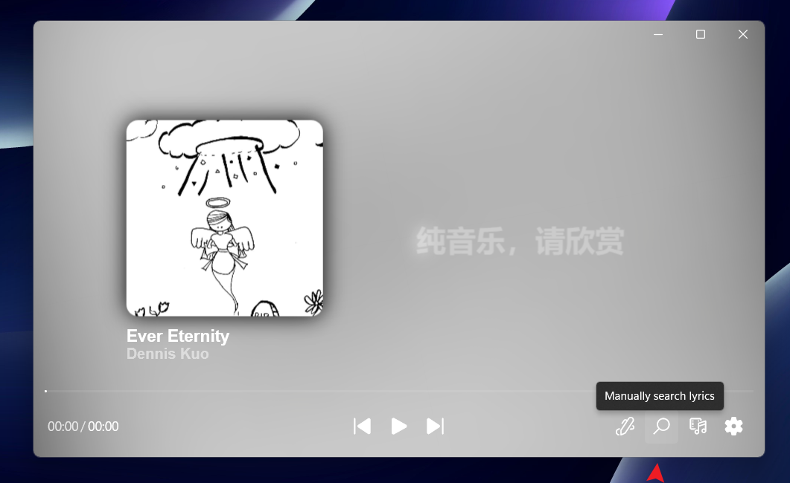
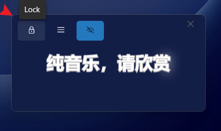
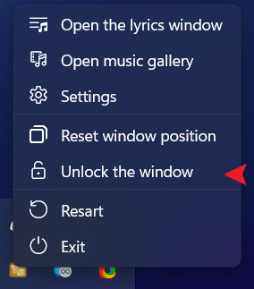
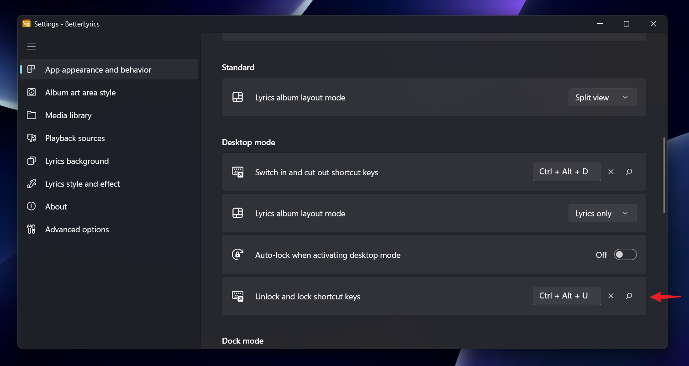
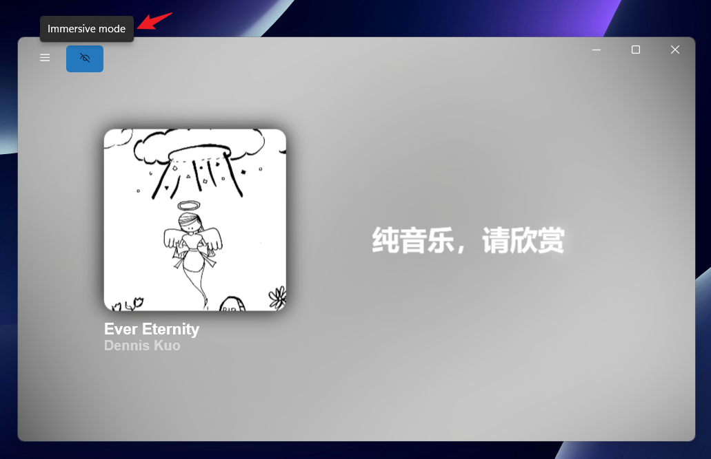

### Where I can find the logs?
`C:\Users\%USERNAME%\AppData\Local\Packages\37412.BetterLyrics_rd1g0rsrrtxw8\LocalCache\logs`

### How to install ".msixbundle" package? (for test package only)
[See this doc](https://github.com/jayfunc/BetterLyrics/blob/dev/How2Install/How2Install.md)

### Lyrics are moving back and forth constantly, how to fix it?

Go to Settings > Playback sources > Disable "Lyrics timeline sync" or increase "Lyrics timeline sync threshold"

### Wrong lyrics are shown, how to fix it?

Open search panel to manually search for the correct lyrics.

### Playback control panel is not showing in dock mode, how to fix it?

Hover over the bottom of the lyrics window and click on the white line to show the playback control panel.

### How to lock/unlock the lyrics window in desktop mode?

Alternatively, you can also use the shortcut `Ctrl+Alt+U` (default) to toggle lock/unlock.

You can change the shortcut in Settings > App appearance and behavior > Unlock and lock shortcut keys

### How to enable/disable immersive mode?
