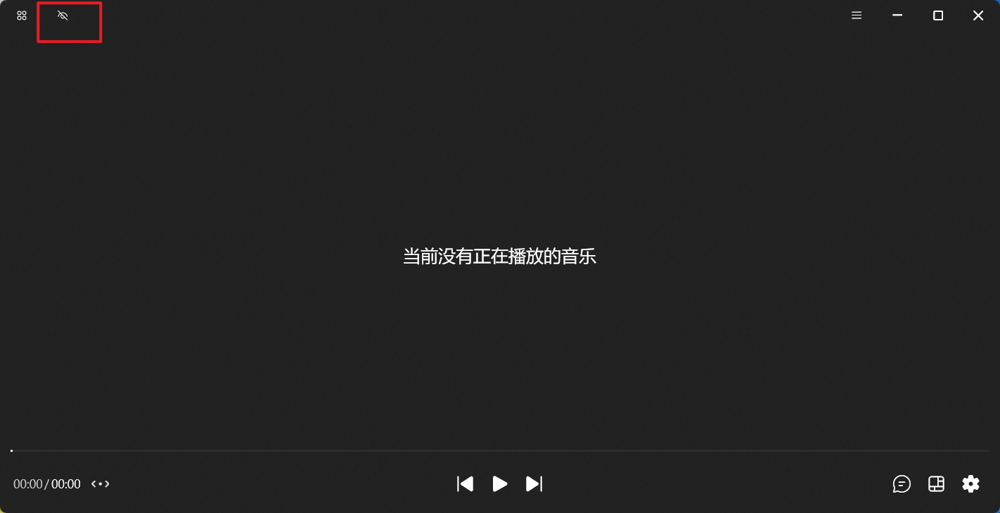

### I couldn't see any button that I can interact with / 我找不到任何可交互的按钮

By default, all the buttons are shown but if you click on the "Immersive" button (as shown in the picture), all the buttons will disappear. But don't worry, one you hover again, it will shown up to you!

默认情况下，所有按钮都会显示，但如果您点击 “沉浸” 按钮（如图左上位置所示），所有按钮都会消失。不过不用担心，当您再次将鼠标悬停在按钮上时，它们就会重新显示出来！

It is important to note that when you enter "Docked Mode", the action buttons are hidden. Hover your mouse over the top to access the "Immerse", "More", and "Close" buttons.

需要特别注意的是，当您进入 “停靠模式” 时，会隐藏操作按钮。将鼠标悬停在顶部以访问 “沉浸” 按钮、“更多” 按钮以及 “关闭” 按钮

Hover the mouse slightly above the bottom edge of the window to display the white control floating window at the bottom

将鼠标悬浮在窗口下边缘稍靠上位置以显示底部控制浮窗小白条

Tap the "little white bar" to display the bottom control bar in floating window form (including current playback progress view, timeline offset adjustment; previous song, pause/play, next song; translation, layout, settings)

点按 “小白条” 即可以浮窗形式显示底部控制栏（包括当前播放进度查看、时间轴偏移调整；上一首、暂停/播放、下一首； 翻译、布局、设置）

### I have set up all the settings related to translation but there is no translation at all

Please make sure that you have already enable "Translation" function (at the bottom-right of the lyrics page, click to toggle).

### How can I lock the window when switching to desktop mode

Again, hover you mouse on the top, click on the lock icon and you're good to go! Or, alternatively, press `Ctrl + Alt + U`.

### How can I unlock the window in desktop mode

It's in the system tray, right-click on the icon and you'll see "Unlock the window". Or, alternatively, press `Ctrl + Alt + U`.

### There's a delay in lyrics timeline

Hover you mouse on the very bottom of the app,

And then click on the first icon button (Lyrics timeline offset), here you can adjust the offset freely.

### The lyrics jump back and forth frequently / 歌词频繁前后跳动

Go to "Advanced options" section, increase the threshold value (marked with the bigger red rectangle) until the lyrics is working properly.

---
