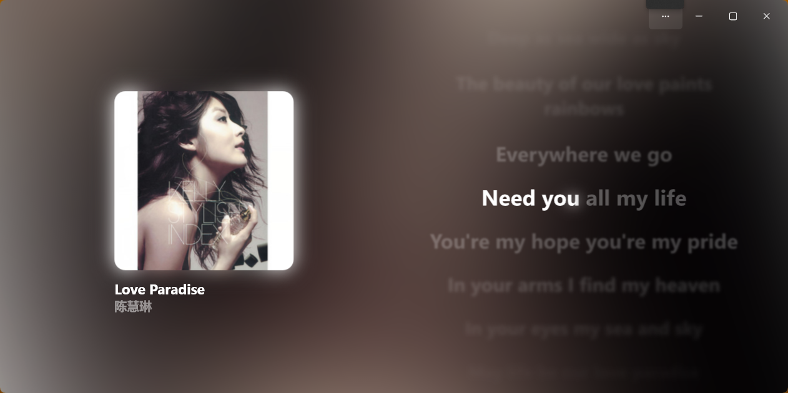
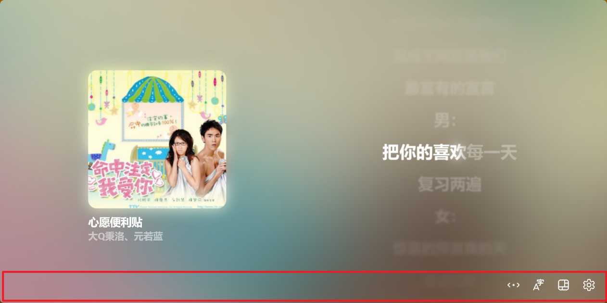
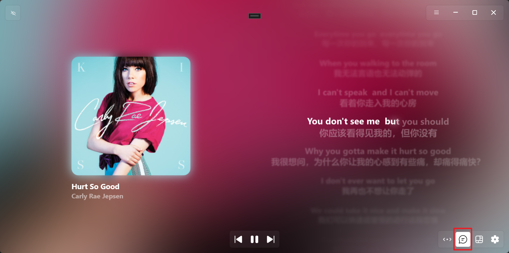
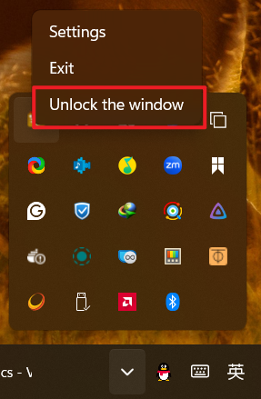
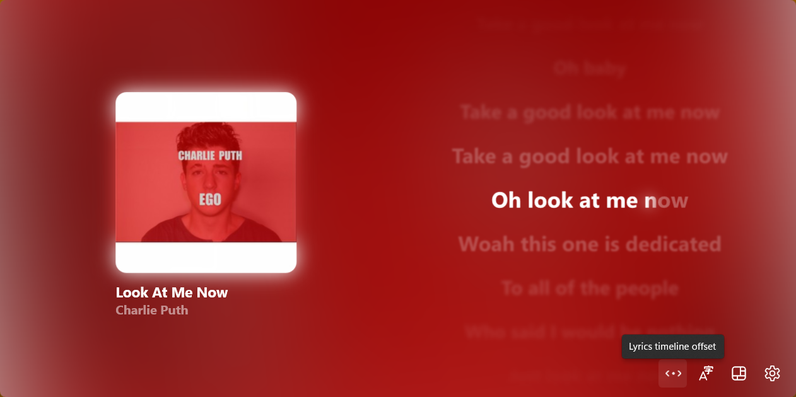
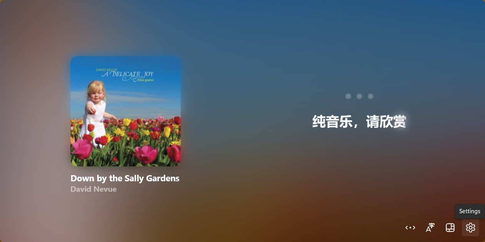
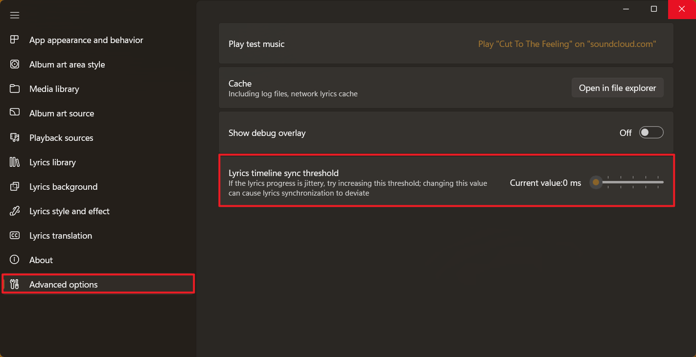

### I couldn't see any button that I can interact with

This app is built with immersive experience, just hover your mouse on the top/bottom area of the app and then you'll see everything.

### I have set up all the settings related to translation but there is no translation at all

Please make sure that you have already enable "Translation" function (at the bottom-right of the lyrics page, click to toggle).

### How can I lock the window when switching to desktop mode

Again, hover you mouse on the top, click on the lock icon and you're good to go! Or, alternatively, press `Ctrl + Alt + U`.

### How can I unlock the window in desktop mode

It's in the system tray, right-click on the icon and you'll see "Unlock the window". Or, alternatively, press `Ctrl + Alt + U`.

### There's a delay in lyrics timeline

Hover you mouse on the very bottom of the app,

And then click on the first icon button (Lyrics timeline offset), here you can adjust the offset freely.

### I'm using Apple Music, the lyrics is moving forward and afterward constantly

Hover your mouse at the very bottom of the app and then click on the very last icon button to go to settings page.

Go to "Advanced options" section, increase the threshold value (marked with the bigger red rectangle) until the lyrics is working properly.

---
