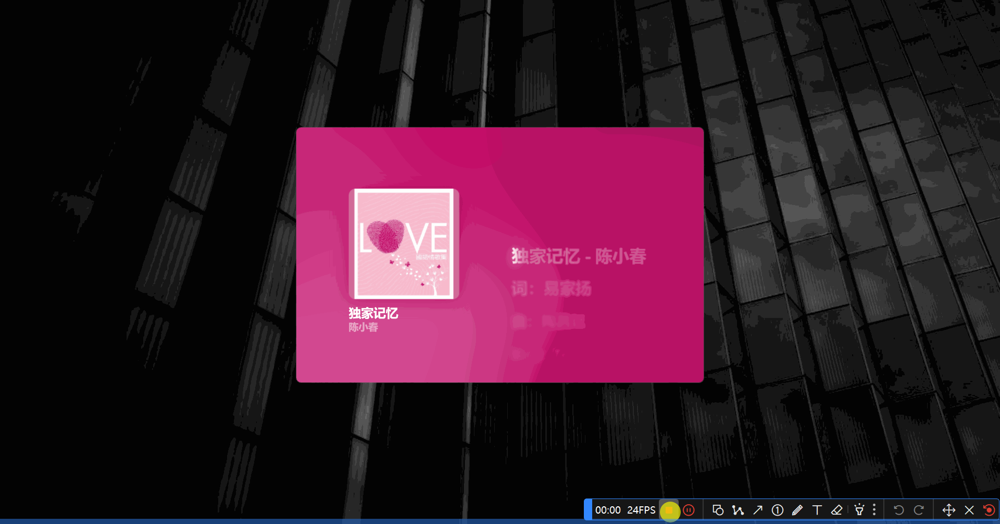
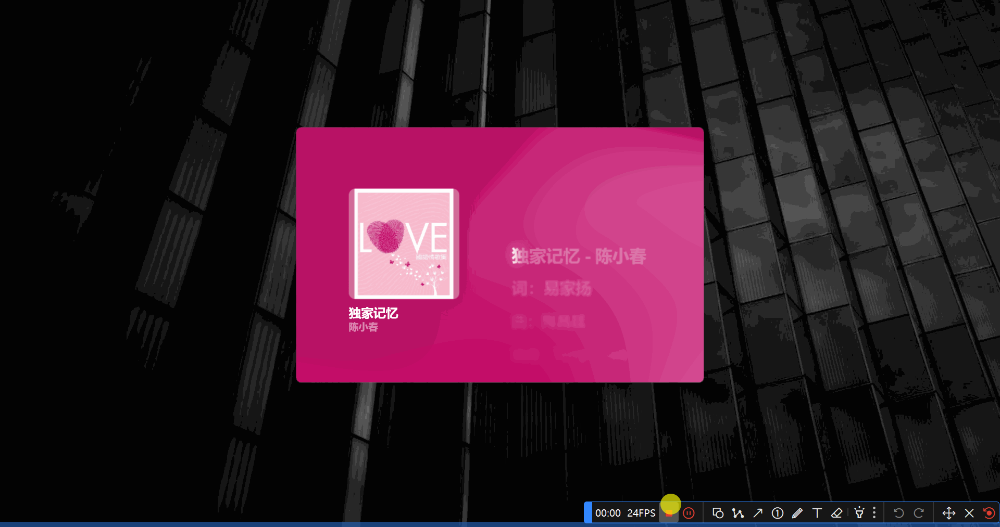
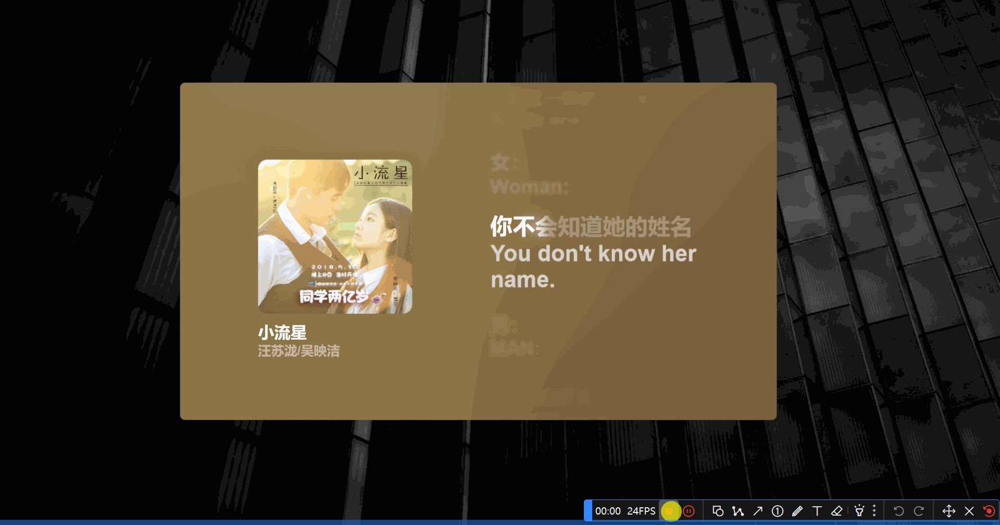
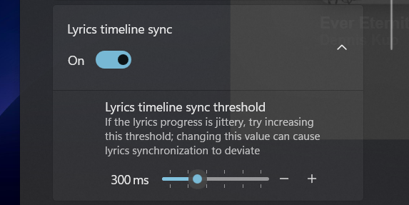

# Welcome to BetterLyrics

### 🤔 Where can I find the logs?
`%LocalAppData%\Packages\37412.BetterLyrics_rd1g0rsrrtxw8\LocalCache\logs`

### 🤔 Where can I find the lyrics cache?
`%LocalAppData%\Packages\37412.BetterLyrics_rd1g0rsrrtxw8\LocalCache\lyrics`

### 🤔 I cannot see any buttons.

By default, the top command bar and the bottom command bar (playback control panel) are automatically hidden when your mouse is out of those areas. Just hover your mouse back to those areas to show them again.

### 🤔 No music is playing now. What should I do?

Some of the players need additional config, check out **Multiple Music Players Supported** under [this](https://github.com/jayfunc/BetterLyrics/blob/dev/README.md#-highlighted-features) section.

### 🤔 How to add more modes?

If this is the first time that you use this app, only the standard mode was initially added for you. To add more modes, follow the steps below:

Settings -> Lyrics window manager -> Create from templates -> Fullscreen mode

### 🤔 How to switch modes?

You can switch modes by pressing the default shortcuts `Ctrl + Alt + S` and then choosing one of the modes displayed on your screen. (Press `Escape` to close the choosing window)

### 🤔 How to move and resize the window? I cannot touch the window.

If you are not able to select and move the window, make sure that you have both:

- Disabled `Click-through` in `Advanced settings` in `Lyrics window manager`.
- Selected **_other than_** `None` in `Draggable area` in `General` in `Lyrics window manager`.

> Click-through ensure that all mouse activity will go through a pinned widget and straight to the underlying game or application - [Microsoft Learn](https://learn.microsoft.com/en-us/gaming/game-bar/guide/click-through)

Alternatively, you can skip the steps above and directly adjust window position and size in `General` in  `Lyrics window manager`. See the clip below.

### 🤔 How to install ".msixbundle" package? (for test package only)
[See this doc](https://github.com/jayfunc/BetterLyrics/blob/dev/Sideloadly/index.md)

### 🤔 Lyrics are moving back and forth constantly.

Go to Settings > Playback sources > Disable "Lyrics timeline sync" or increase "Lyrics timeline sync threshold"

### 🤔 Wrong lyrics are shown.

Open the search panel to manually search for the correct lyrics.

### 🤔 Bottom command bar (playback control panel) is hidden?

By default, the playback control panel at the bottom is hidden automatically when your mouse is out of that area. 

But when the window size is too small to place that panel, only hovering over the bottom of the lyrics window and clicking on the white line can the playback control panel be displayed, or just right-click on the inner side of the window.
