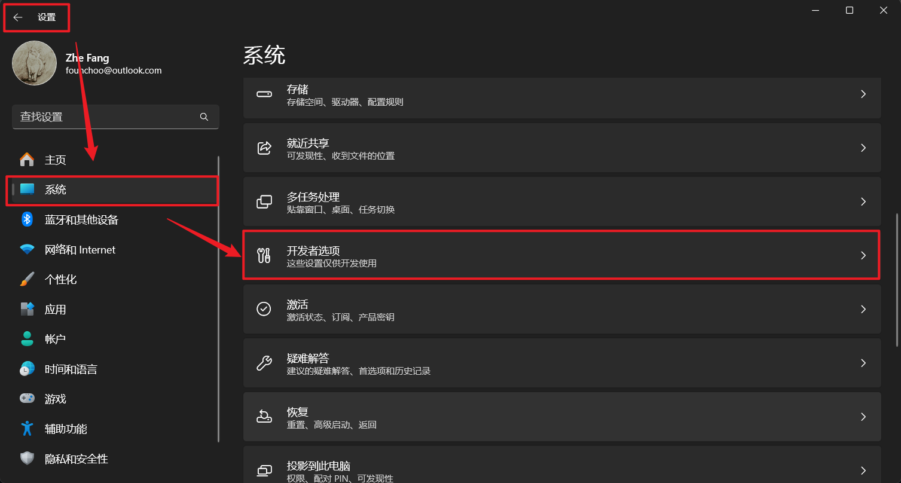
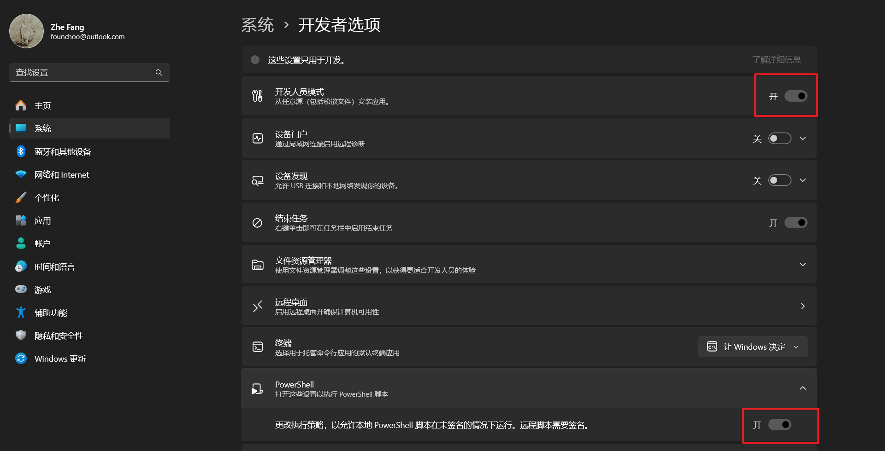
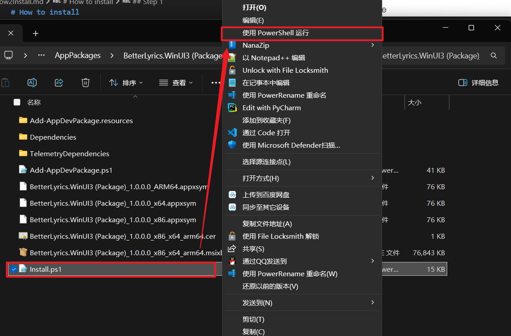
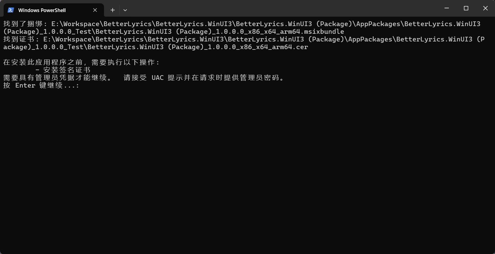
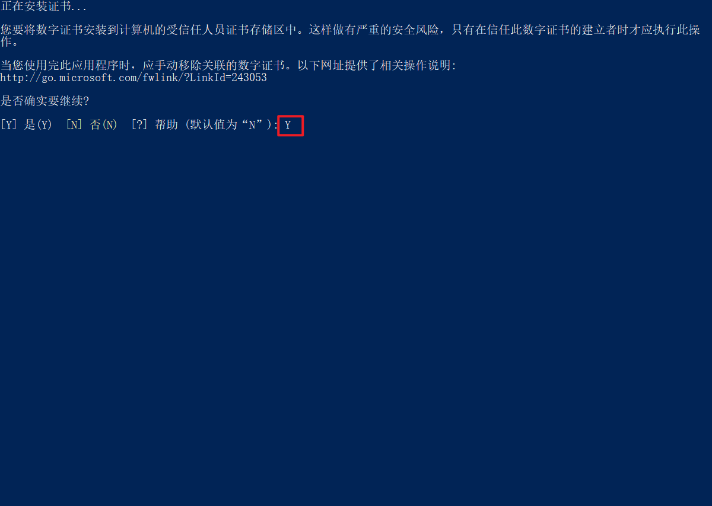
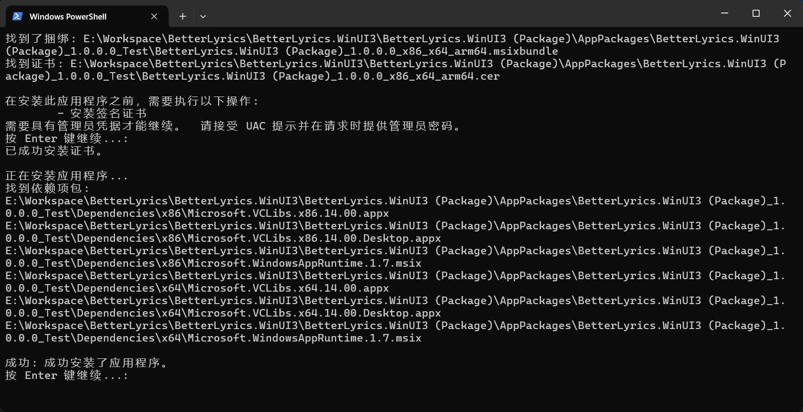

# How to install ".msixbundle" package

## Pre-steps

Be sure that you have already enable developer mode. To do that, you can follow the steps below:

1. Go to "Settings", select "System", go to "Developer Options".
   

2. Turn on "Developer Mode" and enable local PowerShell script allowance.
   

Now you are good to go.

## Step 1

Unzip downloaded .zip file, right-click on "install.ps1", select "Run using PowerShell".

## Step 2

Press "Enter" to continue, and agree on the popup window.

## Step 3

Enter "Y" to install cert.

## Step 4

You are good to go now.

> If you fail to install it with the previous version installed, please try to uninstall the old one and install it again.