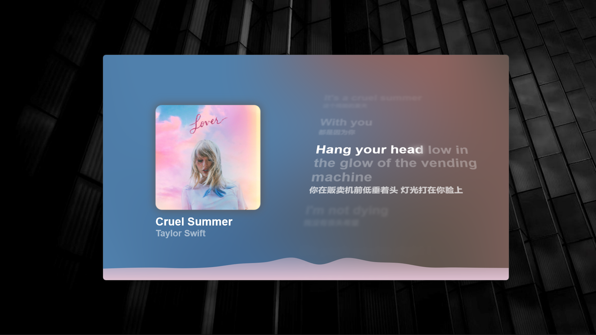
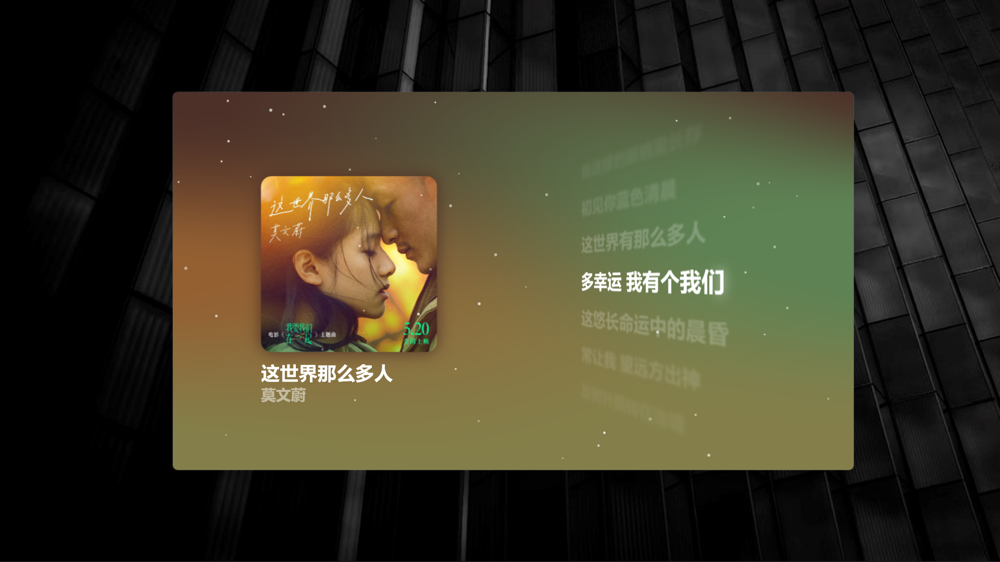
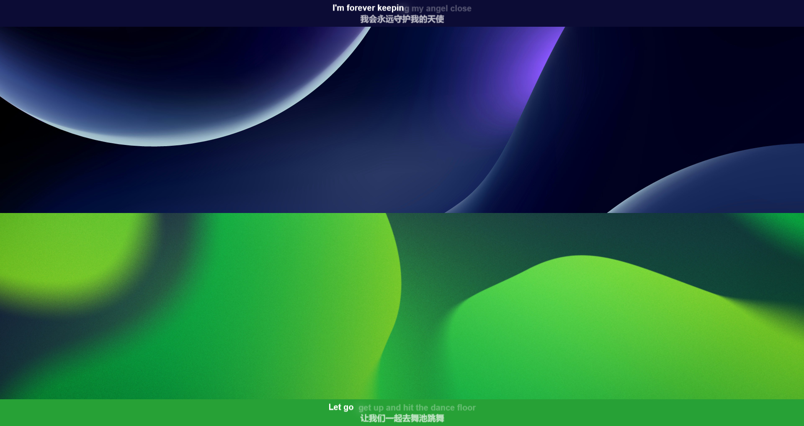
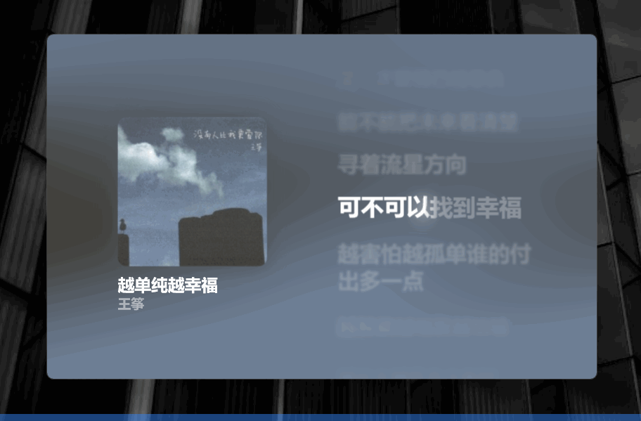

  

<h2 align=center>
BetterLyrics
</h2>

<h4 align="center">
🤩 一款优雅且高度自定义的歌词/播放器应用，基于 WinUI3/Win2D 构建
</h4>

	
[使用指南](https://github.com/jayfunc/BetterLyrics/wiki/使用指南) | [隐私政策](PrivacyPolicy.CN.md) | [服务协议](TermsofService.CN.md)

	

[![zread](https://img.shields.io/badge/Ask_Zread-_.svg?style=flat&color=00b0aa&labelColor=000000&logo=data%3Aimage%2Fsvg%2Bxml%3Bbase64%2CPHN2ZyB3aWR0aD0iMTYiIGhlaWdodD0iMTYiIHZpZXdCb3g9IjAgMCAxNiAxNiIgZmlsbD0ibm9uZSIgeG1sbnM9Imh0dHA6Ly93d3cudzMub3JnLzIwMDAvc3ZnIj4KPHBhdGggZD0iTTQuOTYxNTYgMS42MDAxSDIuMjQxNTZDMS44ODgxIDEuNjAwMSAxLjYwMTU2IDEuODg2NjQgMS42MDE1NiAyLjI0MDFWNC45NjAxQzEuNjAxNTYgNS4zMTM1NiAxLjg4ODEgNS42MDAxIDIuMjQxNTYgNS42MDAxSDQuOTYxNTZDNS4zMTUwMiA1LjYwMDEgNS42MDE1NiA1LjMxMzU2IDUuNjAxNTYgNC45NjAxVjIuMjQwMUM1LjYwMTU2IDEuODg2NjQgNS4zMTUwMiAxLjYwMDEgNC45NjE1NiAxLjYwMDFaIiBmaWxsPSIjZmZmIi8%2BCjxwYXRoIGQ9Ik00Ljk2MTU2IDEwLjM5OTlIMi4yNDE1NkMxLjg4ODEgMTAuMzk5OSAxLjYwMTU2IDEwLjY4NjQgMS42MDE1NiAxMS4wMzk5VjEzLjc1OTlDMS42MDE1NiAxNC4xMTM0IDEuODg4MSAxNC4zOTk5IDIuMjQxNTYgMTQuMzk5OUg0Ljk2MTU2QzUuMzE1MDIgMTQuMzk5OSA1LjYwMTU2IDE0LjExMzQgNS42MDE1NiAxMy43NTk5VjExLjAzOTlDNS42MDE1NiAxMC42ODY0IDUuMzE1MDIgMTAuMzk5OSA0Ljk2MTU2IDEwLjM5OTlaIiBmaWxsPSIjZmZmIi8%2BCjxwYXRoIGQ9Ik0xMy43NTg0IDEuNjAwMUgxMS4wMzg0QzEwLjY4NSAxLjYwMDEgMTAuMzk4NCAxLjg4NjY0IDEwLjM5ODQgMi4yNDAxVjQuOTYwMUMxMC4zOTg0IDUuMzEzNTYgMTAuNjg1IDUuNjAwMSAxMS4wMzg0IDUuNjAwMUgxMy43NTg0QzE0LjExMTkgNS42MDAxIDE0LjM5ODQgNS4zMTM1NiAxNC4zOTg0IDQuOTYwMVYyLjI0MDFDMTQuMzk4NCAxLjg4NjY0IDE0LjExMTkgMS42MDAxIDEzLjc1ODQgMS42MDAxWiIgZmlsbD0iI2ZmZiIvPgo8cGF0aCBkPSJNNCAxMkwxMiA0TDQgMTJaIiBmaWxsPSIjZmZmIi8%2BCjxwYXRoIGQ9Ik00IDEyTDEyIDQiIHN0cm9rZT0iI2ZmZiIgc3Ryb2tlLXdpZHRoPSIxLjUiIHN0cm9rZS1saW5lY2FwPSJyb3VuZCIvPgo8L3N2Zz4K&logoColor=ffffff)](https://zread.ai/jayfunc/BetterLyrics)

<mark>**_💞 BetterLyrics 的发展离不开每一位贡献者、反馈者和用户的全力支持。_**</mark>

<mark>**_项目持续活跃开发中，可能会遇到未知问题。_**</mark>

## 🎉 该项目入选少数派推荐文章！

文章链接：[BetterLyrics - 一款专为 Windows 打造的沉浸式流畅歌词显示软件](https://sspai.com/post/101028)。

## 🔈 反馈交流群

[QQ 群](https://qun.qq.com/universal-share/share?ac=1&authKey=4Q%2BYTq3wZldYpF5SbS5c19ECFsiYoLZFAIcBNNzYpBUtiEjaZ8sZ%2F%2BnFN0qw3lad&busi_data=eyJncm91cENvZGUiOiIxMDU0NzAwMzg4IiwidG9rZW4iOiJiVnhqemVYN0N5QVc3b1ZkR24wWmZOTUtvUkJoWm1JRWlaWW5iZnlBcXJtZUtGc2FFTHNlUlFZMi9iRm03cWF5IiwidWluIjoiMTM5NTczOTY2MCJ9&data=39UmAihyH_o6CZaOs7nk2mO_lz2ruODoDou6pxxh7utcxP4WF5sbDBDOPvZ_Wqfzeey4441anegsLYQJxkrBAA&svctype=4&tempid=h5_group_info) (1054700388) | [Discord Server](https://discord.gg/5yAQPnyCKv) | [Telegram Group](https://t.me/+svhSLZ7awPsxNGY1)

## 🌟 特色功能

- 🌠 **精美的用户界面**
  - 流畅、高度自定义的样式、动画、动效
    - 沉浸式流体背景
    - 透视/扇形歌词
    - 雪花效果
    - 多种歌词滚动函数
    - ...
- ↔️ **强大的歌词翻译**
  - 本地机器翻译 (支持 30 多种语言)
  - 自动读取本地音乐文件内嵌歌词
- 🧩 **多种歌词源**
  - 💾 本地源
    - 音乐文件 (内嵌歌词)
    - [.lrc](<https://en.wikipedia.org/wiki/LRC_(file_format)>) 文件 (传统格式、增强格式)
    - [.eslrc](https://github.com/ESLyric/release) 文件
    - [.ttml](https://en.wikipedia.org/wiki/Timed_Text_Markup_Language) 文件
  - ☁️ 在线源
    - QQ 音乐
    - 网易云音乐
    - 酷狗音乐
    - [amll-ttml-db](https://github.com/Steve-xmh/amll-ttml-db)
    - [LRCLIB](https://lrclib.net/)
    - 

⚠️ Apple Music (需要额外配置)

  		- 浏览器打开 Apple Music，打开开发者工具。刷新网页，回到开发者工具窗口，筛选出 Fetch/XHR，选择一个请求，在请求标头中找到 media-user-token 并复制其值。
		- 打开 BetterLyrics 转到播放源设置。在 Media-User-Token (for Apple Music) 中粘贴复制的值并点按右侧对勾。
 
- 🎶 **支持众多音乐播放器**

  - 点击 [此处](https://github.com/jayfunc/BetterLyrics/wiki/使用指南#已知支持的音乐播放器配置指南) 查看详细信息

- 🪟 **多种显示模式**
  - **标准模式**
    - 标准的歌词窗口样式，沉浸式的音乐歌词体验。
  - **停靠模式**
    - 停靠在屏幕上/下边缘的轻量歌词窗口，工作休闲互不打扰。
  - **桌面模式**
    - 悬浮在所有应用上层，不能被选中，但能直击你的使用需求。
  - **更多模式...**
    - 等你来发现... 
- 🧠 **智能化行为**
  - 根据歌曲播放状态自动显隐歌词窗口

## 🖼️ 屏幕截图

> ⚠️ 由于 GIF 格式帧率限制，效果仅作展示。请以实机效果为准。

## 📹 演示

在 [哔哩哔哩](https://www.bilibili.com/video/BV1QRstz1EGt/) 上观看于 2025 年 10 月 21 日上传的演示视频。

## 🧪 即刻体验

**无限期**免费试用版和付费版**无任何区别**。

如果喜欢该软件，请考虑 [捐赠](#-捐赠) 或在 **Microsoft Store** 购买，感谢您的支持！ 🥰

无法从 Microsoft Store 下载？尝试以下方法：
- [从 Microsoft Store 外部下载](https://www.cnblogs.com/jayfunc/p/19212083)
- 转至 [最新发布页](https://github.com/jayfunc/BetterLyrics/releases/latest) 并从 `Assets`（资产）列表下载 `.zip` 文件。(安装方法参考 [此文档](https://www.cnblogs.com/jayfunc/p/19212078)。)

## 🏗️ 构建

在构建之前确保替换文件 `BetterLyrics\BetterLyrics.WinUI3\BetterLyrics.WinUI3\Constants\LastFMTemplate` 为 `BetterLyrics\BetterLyrics.WinUI3\BetterLyrics.WinUI3\Constants\LastFM.cs`。

## 🤑 捐赠

如果你喜欢本应用，请考虑捐赠支持开发者。这将有助于本应用的长远发展。

通过以下途径捐赠：
- [PayPal](https://paypal.me/zhefangpay)
- [Buy Me a Coffee](https://buymeacoffee.com/founchoo)
- 

支付宝

    
  
  
  </detais>

- 

微信

    
  
  
  

本项目的持续发展离不开大家的支持。**[查看完整鸣谢名单](SPONSORS.md)**

## 📄 许可证

本项目采用 GNU 通用公共许可证 v3.0 授权。详情请参阅 [LICENSE](https://github.com/jayfunc/BetterLyrics/blob/dev/LICENSE) 文件。

## 💖 感谢

部分功能及代码引用或修改自公开资料库，包括但不限于下述开源项目/包、教程等，在此一并感谢。

| 项目/包 | 描述 |
| :--- | :--- |
| [Lyricify-Lyrics-Helper](https://github.com/WXRIW/Lyricify-Lyrics-Helper) | 为 QQ、网易、酷狗在线歌词源提供歌词抓取、解密、解析等一系列方法 |
| [lrclib](https://github.com/tranxuanthang/lrclib) | LRCLIB 歌词 API |
| [Manzana-Apple-Music-Lyrics](https://github.com/dropcreations/Manzana-Apple-Music-Lyrics) | Apple Music 歌词抓取（Python 实现） |
| [Audio Tools Library (ATL) for .NET](https://github.com/Zeugma440/atldotnet) | 从音乐文件提取图片 |
| [WinUIEx](https://github.com/dotMorten/WinUIEx) | 提供有关窗口的开箱即用的 Win32 API |
| [TagLib#](https://github.com/mono/taglib-sharp) | 读取音乐文件内嵌的原始歌词内容 |
| [Vanara](https://github.com/dahall/Vanara) | 提供开箱即用的 Win32 API |
| [LibreTranslate](https://github.com/LibreTranslate/LibreTranslate) | 离线翻译核心 |
| [Isolation](https://github.com/Storyteller-Studios/Isolation) | 动态流体背景 |
| [SpectrumVisualization](https://github.com/Johnwikix/SpectrumVisualization) | 频谱图 |
| [DevWinUI](https://github.com/ghost1372/DevWinUI) | 为 WinUI3 提供众多开箱即用的功能 |
| ... | ... |

点按 [此处](https://github.com/jayfunc/BetterLyrics/network/dependencies) 查看所有依赖。

### 教程、博客等

- [Stackoverflow - How to animate Margin property in WPF](https://stackoverflow.com/a/21542882/11048731)
- [Bilibili -【WinUI3】SystemBackdropController：定义云母、亚克力效果](https://www.bilibili.com/video/BV1PY4FevEkS)
- [cnblogs - .NET App 与 Windows 系统媒体控制(SMTC)交互](https://www.cnblogs.com/TwilightLemon/p/18279496)
- [Win2D 中的游戏循环：CanvasAnimatedControl](https://www.cnblogs.com/walterlv/p/10236395.html)
- [r2d2rigo/Win2D-Samples](https://github.com/r2d2rigo/Win2D-Samples/blob/master/IrisBlurWin2D/IrisBlurWin2D/MainPage.xaml.cs)
- [CommunityToolkit - 从入门到精通](https://mvvm.coldwind.top/)

## 💡 灵感来源

部分设计思路参考自下述插件/软件（不含间接或直接引用、修改的代码，仅作为设计思路指导方向）。

- [refined-now-playing-netease](https://github.com/solstice23/refined-now-playing-netease)
- [Lyricify-App](https://github.com/WXRIW/Lyricify-App)
- [椒盐音乐 Salt Player](https://moriafly.com/program/salt-player)
- [MyToolBar](https://github.com/TwilightLemon/MyToolBar)

## ✍️ 协助翻译

找不到你的语言？有更好的翻译？没关系！😆

现在访问 https://crowdin.com/project/betterlyrics/invite?h=c9bfb28fce061484883c0891e7a26f9b2592556 即刻为本应用提供翻译，成为贡献者！

## ⭐ 星标记录

  

## 🤗 欢迎反馈问题、提交代码

如果发现 Bug 请在 Issues 内提出，同时也欢迎任何想法、建议。

## ⚠️ 免责声明

本项目按“原样”提供，不提供任何形式的担保。
所有歌词、字体、图标及其他第三方资源均为其各自版权所有者的财产。
本项目作者不主张对这些资源的所有权。
本项目为非商业用途，不得用于侵犯任何权利。
用户有责任确保其使用符合适用的法律和许可协议。

## 💭 社交媒体分享

