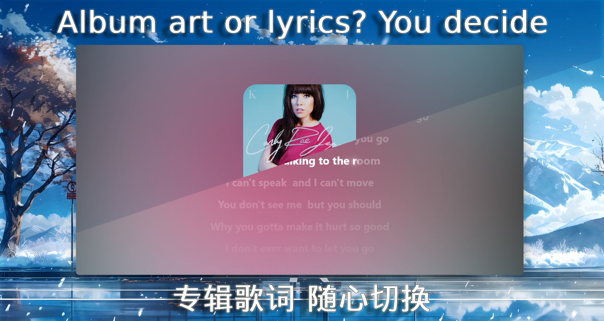
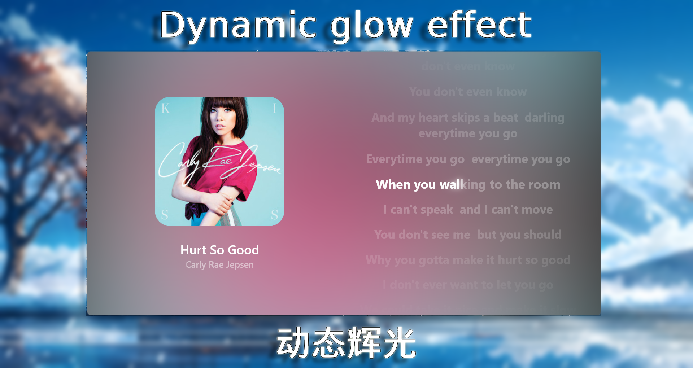
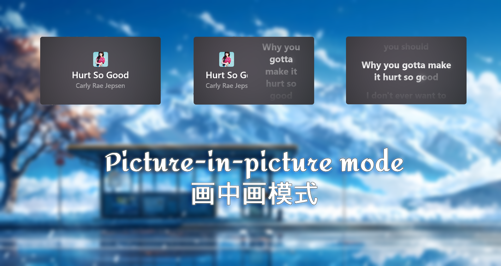
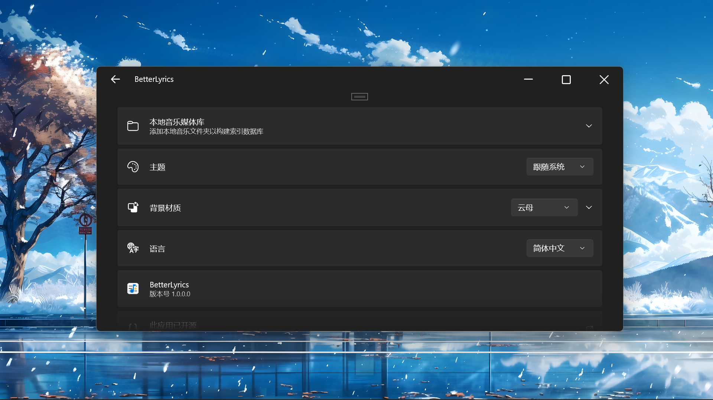
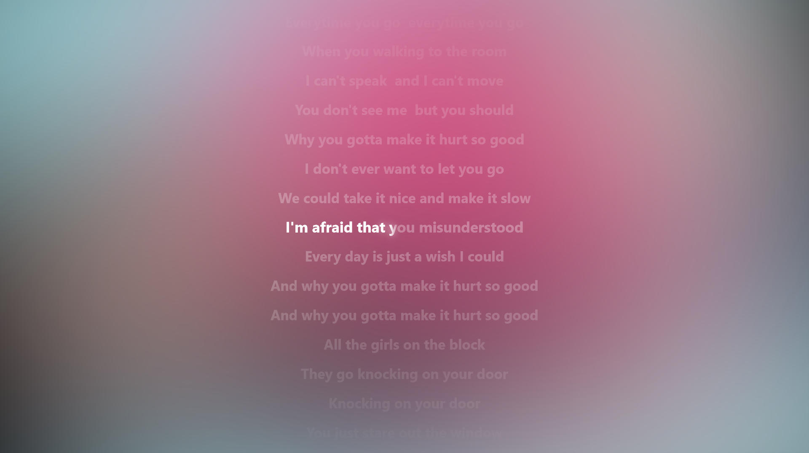

<a href="https://github.com/jayfunc/BetterLyrics/blob/dev/README.md">_**Click here to see the English version**_</a>

<h2 align="center">
BetterLyrics

<h3 align="center">
使用 WinUI 3 构建的流畅动态歌词显示工具

---

## 亮点功能

- 动态模糊专辑封面作为背景
- 流畅的歌词淡入/淡出、放大/缩小效果
- 流畅的用户界面随歌曲切换
- 每个字符均支持渐变卡拉 OK（带光晕）效果
- 沉浸式桌面歌词（停靠模式）

> 该项目目前仍在开发中，最新的开发分支中可能存在错误和意外行为。

## 支持的歌词来源

- 来自您的本地存储
  - 音乐文件（内嵌歌词）
  - [.lrc](https://en.wikipedia.org/wiki/LRC_(file_format)) 文件（包含核心格式和增强格式）
  - [.eslrc](https://github.com/ESLyric/release) 文件
  - [.ttml](https://en.wikipedia.org/wiki/Timed_Text_Markup_Language) 文件

（歌词下载，您可以使用 [LDDC](https://github.com/chenmozhijin/LDDC))

- 来自在线歌词提供商
  - QQ 音乐
  - 网易云音乐
  - 酷狗音乐
  - [amll-ttml-db](https://github.com/Steve-xmh/amll-ttml-db)
  - [LRCLIB](https://lrclib.net/)

## 截图

## 演示

在 Bilibili 上观看我们的介绍视频（上传于 2025 年 5 月 31 日） [此处](https://b23.tv/QjKkYmL)。

## 立即体验

- 稳定版本

> **最简单**的获取方式。 **无限**免费试用或购买（免费版和付费版**没有区别**，如果您喜欢，可以购买来支持我）

或者您也可以从 Google Drive 获取（链接见 [release](https://github.com/jayfunc/BetterLyrics/releases/latest) 页面）

> 请注意，您正在下载“.zip”文件，有关安装指南，请参考[此文档](How2Install/How2Install.md)。

- 最新开发版本

您可以使用 `git clone` 命令克隆此项目并自行构建。

## 已知不支持的音乐播放器

- 网易云音乐

## 非常感谢

- [Lyricify-Lyrics-Helper](https://github.com/WXRIW/Lyricify-Lyrics-Helper)
  - 提供 QQ、网易、酷狗等平台歌词的获取、解密和解析功能
- [LRCLIB](https://lrclib.net/)
  - LRCLIB 歌词 API 提供程序
- [Audio Tools Library (ATL) for .NET](https://github.com/Zeugma440/atldotnet)
  - 用于提取音乐文件中的图片
- [WinUIEx](https://github.com/dotMorten/WinUIEx)
  - 提供访问 Win32 窗口 API 的便捷方法
- [TagLib#](https://github.com/mono/taglib-sharp)
  - 用于读取原版歌词内容
- [Stackoverflow - 如何在 WPF 中为 Margin 属性设置动画](https://stackoverflow.com/a/21542882/11048731)
- [DevWinUI](https://github.com/ghost1372/DevWinUI)
- [Bilibili -【WinUI3】SystemBackdropController：定义云母、亚克力效果](https://www.bilibili.com/video/BV1PY4FevEkS)
- [cnblogs - .NET App 与 Windows 系统媒体控制(SMTC)交互](https://www.cnblogs.com/TwilightLemon/p/18279496)
- [Win2D中的游戏循环：CanvasAnimatedControl](https://www.cnblogs.com/walterlv/p/10236395.html)
- [r2d2rigo/Win2D-Samples](https://github.com/r2d2rigo/Win2D-Samples/blob/master/IrisBlurWin2D/IrisBlurWin2D/MainPage.xaml.cs)
- [CommunityToolkit - 从入门到精通](https://mvvm.coldwind.top/)

## 灵感来自

- [refined-now-playing-netease](https://github.com/solstice23/refined-now-playing-netease)
- [Lyricify-App](https://github.com/WXRIW/Lyricify-App)
- [椒盐音乐 Salt Player](https://moriafly.com/program/salt-player)
- [MyToolBar](https://github.com/TwilightLemon/MyToolBar)

## Star 历史

## 欢迎提出任何问题和 PR

如果您发现错误，请提交至 issues；如果您有任何想法，请随时在此处分享。

或者，您也可以加入群聊，分享您的宝贵反馈：
- QQ[「BetterLyrics」反馈交流群](https://qun.qq.com/universal-share/share?ac=1&authKey=4Q%2BYTq3wZldYpF5SbS5c19ECFsiYoLZFAIcBNNzYpBUtiEjaZ8sZ%2F%2BnFN0qw3lad&busi_data=eyJncm91cENvZGUiOiIxMDU0NzAwMzg4IiwidG9rZW4iOiJiVnhqemVYN0N5QVc3b1ZkR24wWmZOTUtvUkJoWm1JRWlaWW5iZnlBcXJtZUtGc2FFTHNlUlFZMi9iRm03cWF5IiwidWluIjoiMTM5NTczOTY2MCJ9&data=39UmAihyH_o6CZaOs7nk2mO_lz2ruODoDou6pxxh7utcxP4WF5sbDBDOPvZ_Wqfzeey4441anegsLYQJxkrBAA&svctype=4&tempid=h5_group_info) (1054700388)
- Discord [「BetterLyrics」反馈交流群](https://discord.gg/rbnF556r)