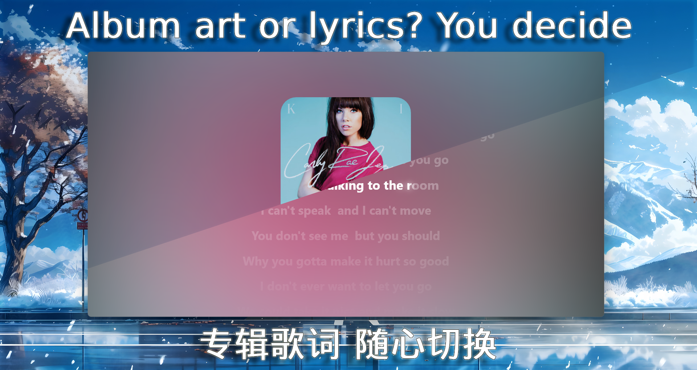
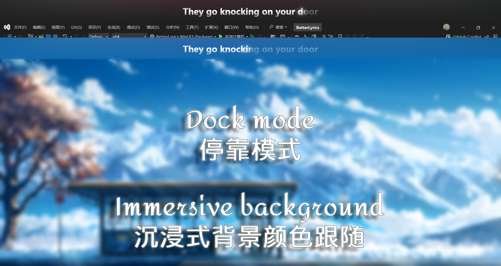
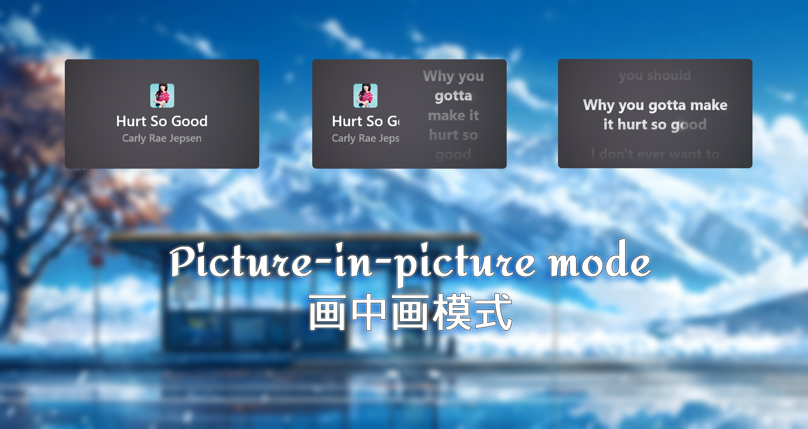

<a href="https://github.com/jayfunc/BetterLyrics/blob/dev/README.md">_**Click here to see the English version**_</a>

<div align="center">
  
</div>

<h2 align="center">
BetterLyrics
</h2>

<h3 align="center">
基于 WinUI 3 打造的流畅动态本地歌词显示工具
</h3>

---

## 亮点

- 支持将模糊专辑封面设为背景  
- 歌词淡入淡出、缩放等动画流畅自然  
- 切换歌曲时界面无缝过渡  
- 支持每个字符的渐变卡拉OK（发光）效果  
- 沉浸式桌面歌词（Dock 模式）

> 项目仍在开发中，`dev` 分支可能存在 bug。

---

## 支持的歌词源

- 本地歌词：
  - 音乐文件内嵌歌词（通过 [Audio Tools Library (ATL) for .NET](https://github.com/Zeugma440/atldotnet) 读取和解析）  
  - `.lrc` 文件

- 在线歌词源：
  - [LRCLIB](https://lrclib.net/)  
  - QQ 音乐（通过 [Lyricify-Lyrics-Helper](https://github.com/WXRIW/Lyricify-Lyrics-Helper) 获取和解码）

---

## 多种个性化设置选项

提供了丰富的自定义项：

- 主题模式（浅色、深色、跟随系统）  
- 背景样式（无、Mica 云母、Acrylic 亚克力、透明）  
- 专辑封面背景（动态显示、模糊程度、透明度）  
- 歌词样式（对齐方式、字体大小、颜色 **（从专辑封面中提取主题色）**、行间距、透明度、模糊强度、动态**发光**特效）  
- 语言（英文、简体中文、繁体中文）

---

## 软件截图

  
  
  
  
  
  
  
  


---

## 演示视频

观看我们的介绍视频「BetterLyrics 阶段性开发成果展示」（上传于 2025 年 5 月 31 日）：  
[点此观看 B 站视频](https://b23.tv/QjKkYmL)

---

## 立即体验

### 稳定版本

<a href="https://apps.microsoft.com/detail/9P1WCD1P597R?referrer=appbadge&mode=direct">
 
</a>

> **推荐方式**，**永久免费试用或购买**（免费与付费功能上无差别，若喜欢可购买支持作者）

也可从 Google Drive 下载（详见 [release 页面](https://github.com/jayfunc/BetterLyrics/releases/latest)）

> 注意：这是一个 `.zip` 压缩包，请参考[安装指南](How2Install/How2Install.md)进行安装。

### 最新开发版本

可通过 `git clone` 克隆本仓库后自行构建运行。

---

## 播放器适配说明

本项目通过监听 [SMTC](https://learn.microsoft.com/en-ca/windows/uwp/audio-video-camera/integrate-with-systemmediatransportcontrols) 获取当前播放歌曲信息。  
理论上，**只要你的播放器支持 SMTC 控件**，加载本地音乐或歌词后即可使用。

兼容性良好的播放器包括但不限于：

- Spotify  
- Groove 音乐  
- Apple Music  
- Windows 媒体播放器  
- VLC  
- QQ 音乐  
- 酷狗音乐  
- 酷我音乐  

>（注：未测试全部播放器，如有异常欢迎反馈 issue）

---

## 后续工作

敬请期待。

---

## 特别感谢

- [LRCLIB](https://lrclib.net/)
  - 在线歌词 API 提供源
- [Audio Tools Library (ATL) for .NET](https://github.com/Zeugma440/atldotnet)
  - 本地音频元信息读取  
- [WinUIEx](https://github.com/dotMorten/WinUIEx)
  - 简化 Win32 窗口操作  
- [TagLib#](https://github.com/mono/taglib-sharp)
  - 曾用作元信息解析库  
- [Stackoverflow - WPF 动画 Margin 属性](https://stackoverflow.com/a/21542882/11048731)  
- [DevWinUI](https://github.com/ghost1372/DevWinUI)  
- [Bilibili -【WinUI3】SystemBackdropController 教程](https://www.bilibili.com/video/BV1PY4FevEkS)  
- [博客园 - .NET App 与 SMTC 交互](https://www.cnblogs.com/TwilightLemon/p/18279496)  
- [Win2D 游戏循环教程](https://www.cnblogs.com/walterlv/p/10236395.html)  
- [Win2D Iris Blur 示例](https://github.com/r2d2rigo/Win2D-Samples/blob/master/IrisBlurWin2D/IrisBlurWin2D/MainPage.xaml.cs)  
- [CommunityToolkit - 教程合集](https://mvvm.coldwind.top/)

---

## 灵感来源

- [refined-now-playing-netease](https://github.com/solstice23/refined-now-playing-netease)  
- [Lyricify-App](https://github.com/WXRIW/Lyricify-App)  
- [椒盐音乐 Salt Player](https://moriafly.com/program/salt-player)  
- [MyToolBar](https://github.com/TwilightLemon/MyToolBar)

---

## 使用的第三方库

```xml
<PackageReference Include="CommunityToolkit.Labs.WinUI.MarqueeText" Version="0.1.230830" />
<PackageReference Include="CommunityToolkit.Labs.WinUI.OpacityMaskView" Version="0.1.250513-build.2126" />
<PackageReference Include="CommunityToolkit.Mvvm" Version="8.4.0" />
<PackageReference Include="CommunityToolkit.WinUI.Behaviors" Version="8.2.250402" />
<PackageReference Include="CommunityToolkit.WinUI.Controls.Primitives" Version="8.2.250402" />
<PackageReference Include="CommunityToolkit.WinUI.Controls.Segmented" Version="8.2.250402" />
<PackageReference Include="CommunityToolkit.WinUI.Controls.SettingsControls" Version="8.2.250402" />
<PackageReference Include="CommunityToolkit.WinUI.Converters" Version="8.2.250402" />
<PackageReference Include="CommunityToolkit.WinUI.Extensions" Version="8.2.250402" />
<PackageReference Include="CommunityToolkit.WinUI.Helpers" Version="8.2.250402" />
<PackageReference Include="CommunityToolkit.WinUI.Media" Version="8.2.250402" />
<PackageReference Include="Lyricify.Lyrics.Helper" Version="0.1.4" />
<PackageReference Include="Microsoft.Extensions.DependencyInjection" Version="9.0.6" />
<PackageReference Include="Microsoft.Extensions.Logging" Version="9.0.6" />
<PackageReference Include="Microsoft.Graphics.Win2D" Version="1.3.2" />
<PackageReference Include="Microsoft.Windows.SDK.BuildTools" Version="10.0.26100.4188" />
<PackageReference Include="Microsoft.WindowsAppSDK" Version="1.7.250606001" />
<PackageReference Include="Microsoft.Xaml.Behaviors.WinUI.Managed" Version="3.0.0" />
<PackageReference Include="Newtonsoft.Json" Version="13.0.3" />
<PackageReference Include="Serilog.Extensions.Logging" Version="9.0.2" />
<PackageReference Include="Serilog.Sinks.File" Version="7.0.0" />
<PackageReference Include="System.Drawing.Common" Version="9.0.6" />
<PackageReference Include="System.Text.Encoding.CodePages" Version="9.0.6" />
<PackageReference Include="Ude.NetStandard" Version="1.2.0" />
<PackageReference Include="WinUIEx" Version="2.5.1" />
<PackageReference Include="z440.atl.core" Version="6.25.0" />
```

## Star 历史

[](https://www.star-history.com/#jayfunc/BetterLyrics&Date)

## 欢迎提出反馈或建议

感谢。


