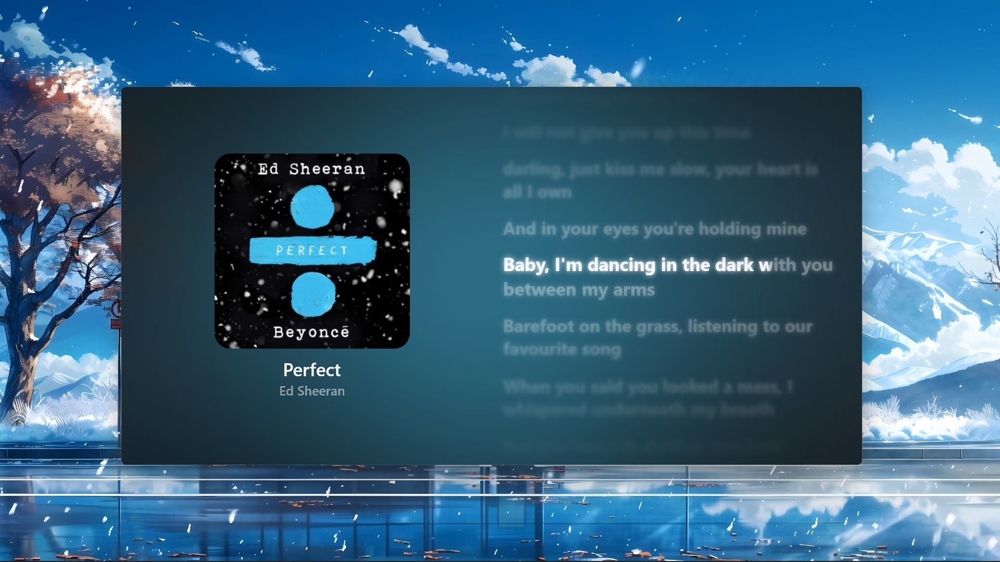
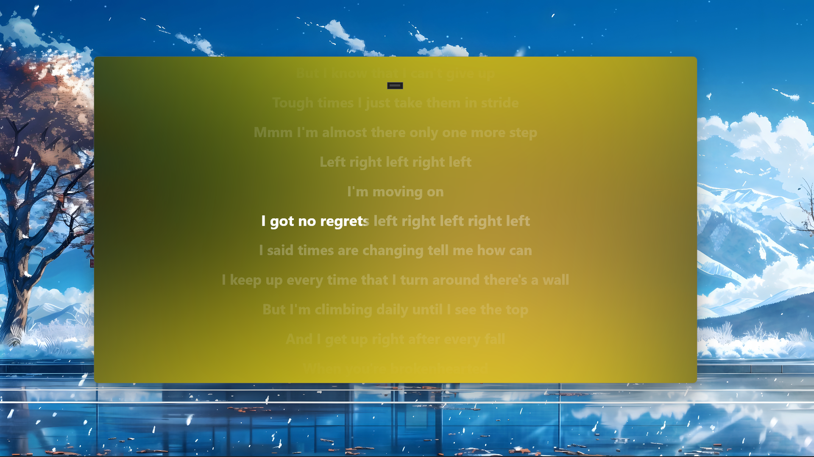
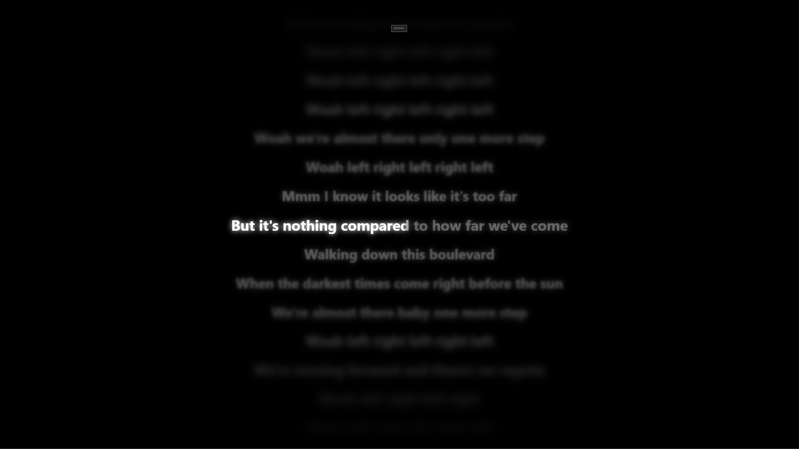
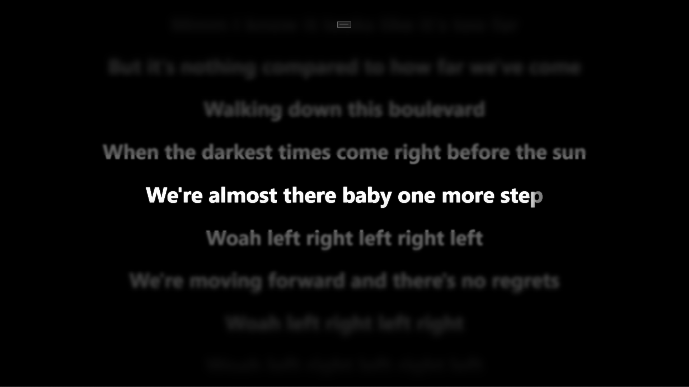
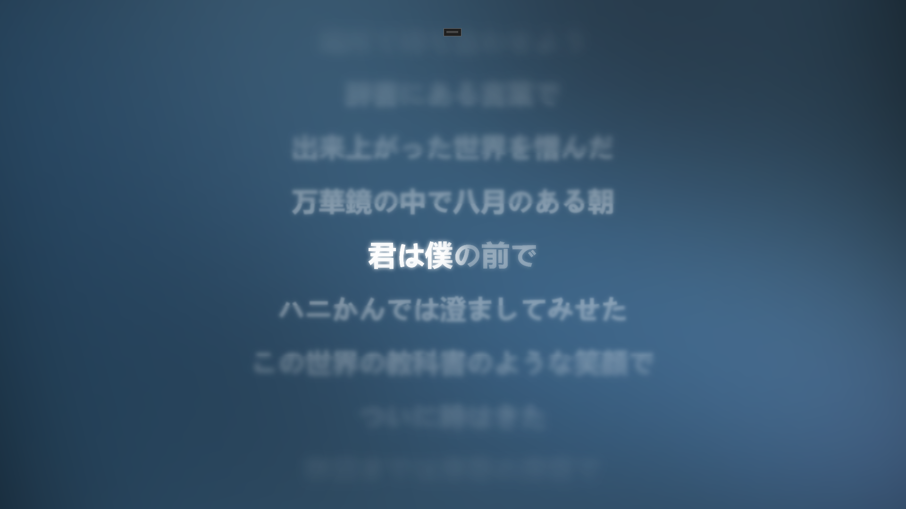
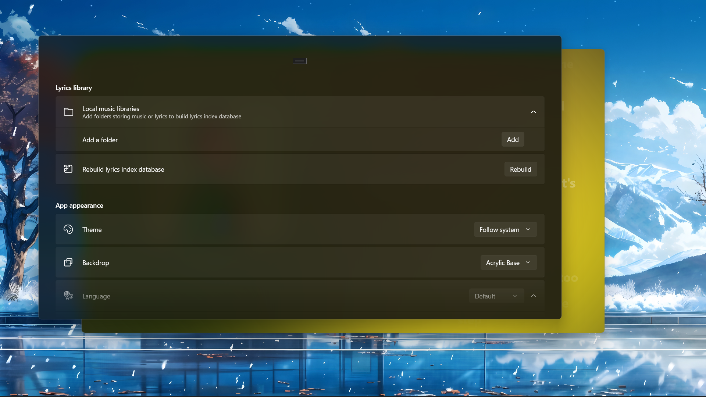
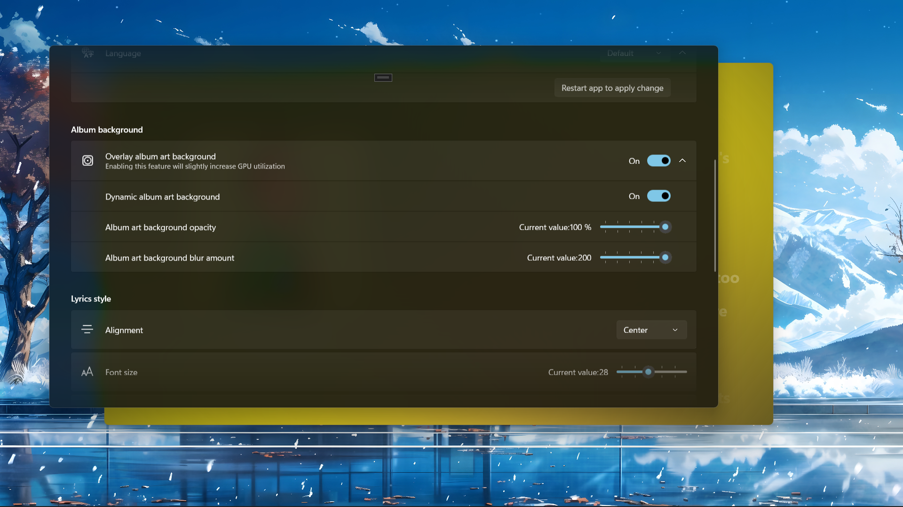
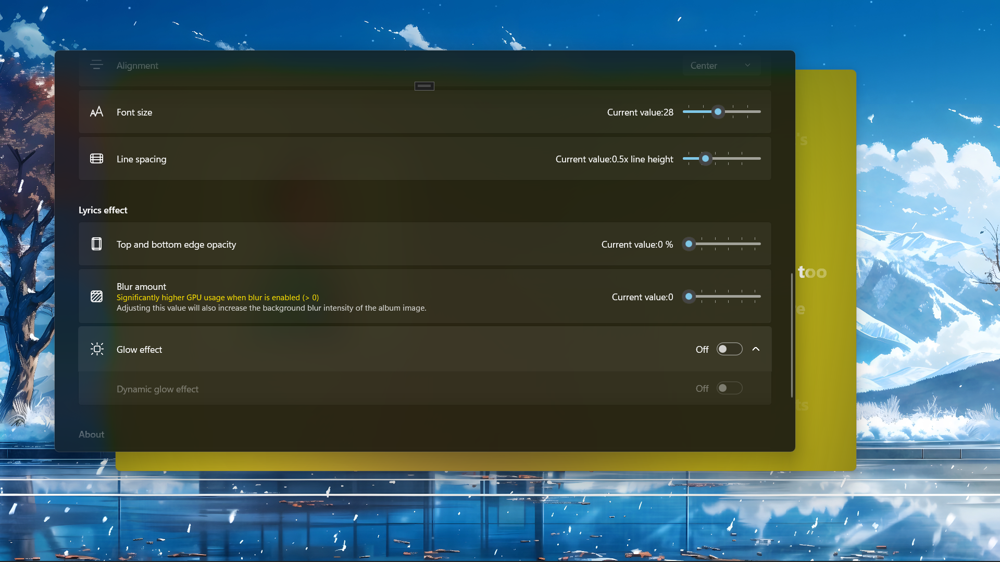
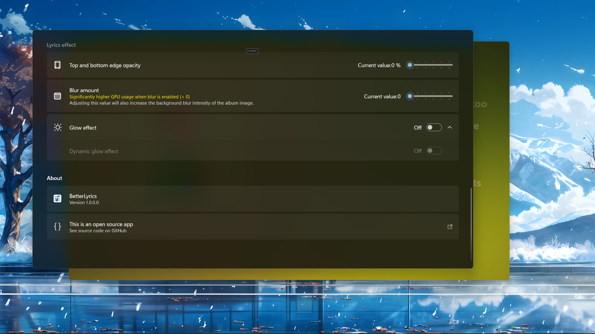

<div align="center">
  
</div>

<h2 align="center">
BetterLyrics
</div>

<h3 align="center">
Your smooth dynamic local lyrics display built with WinUI 3
</div>

---

## Highlighted features

- Dynamic blur album art as background
- Smooth lyrics fade in/out, zoom in/out effects
- Smooth user interface change from song to song
- Gradient Karaoke effect on every single character

Coding in progress...

## Customize in your way

We provide more than one setting item to better align with your preference

- Theme (light, dark, follow system)

- Backdrop (none, mica, acrylic, transparent)

- Album art as background (dynamic, blur amount, opacity)

- Lyrics (alignment, font size, line spacing, opacity, blur amount, dynamic glow effect)

- Language (English, Simplified Chinese, Traditional Chinese)

## Live demonstration


Or watch our introduction video「BetterLyrics 阶段性开发成果展示」(uploaded on 31 May 2025) on Bilibili below (click the cover image to watch):

[](https://b23.tv/QjKkYmL)

## Screenshots

### Split view





### Fullscreen





### Settings






## Try it now

[](https://apps.microsoft.com/detail/9P1WCD1P597R)

or alternatively visit [Google Drive](https://drive.google.com/file/d/1Hh8ijbODIksPmmRYujys7fXngw93Of7I/view?usp=sharing).

To learn about how to install ".msixbundle" package, see [this doc](How2Install/How2Install.md).

## Many thanks to

- [Audio Tools Library (ATL) for .NET](https://github.com/Zeugma440/atldotnet)
- [DevWinUI](https://github.com/ghost1372/DevWinUI)
- [Stackoverflow - How to animate Margin property in WPF](https://stackoverflow.com/a/21542882/11048731)
- [TagLib#](https://github.com/mono/taglib-sharp)
- [Bilibili -【WinUI3】SystemBackdropController：定义云母、亚克力效果](https://www.bilibili.com/video/BV1PY4FevEkS)
- [cnblogs - .NET App 与 Windows 系统媒体控制(SMTC)交互](https://www.cnblogs.com/TwilightLemon/p/18279496)
- [Win2D 中的游戏循环：CanvasAnimatedControl](https://www.cnblogs.com/walterlv/p/10236395.html)
- [r2d2rigo/Win2D-Samples](https://github.com/r2d2rigo/Win2D-Samples/blob/master/IrisBlurWin2D/IrisBlurWin2D/MainPage.xaml.cs)

## Inspired by

- [BetterNCM](https://github.com/std-microblock/BetterNCM)
- [Lyricify-App](https://github.com/WXRIW/Lyricify-App)
- [椒盐音乐 Salt Player](https://moriafly.com/program/salt-player)

## Third-party libraries that this project uses

```
<PackageReference Include="CommunityToolkit.Labs.WinUI.MarqueeText" Version="0.1.230830" />
<PackageReference Include="CommunityToolkit.Labs.WinUI.OpacityMaskView" Version="0.1.250513-build.2126" />
<PackageReference Include="CommunityToolkit.Mvvm" Version="8.4.0" />
<PackageReference Include="CommunityToolkit.WinUI.Behaviors" Version="8.2.250402" />
<PackageReference Include="CommunityToolkit.WinUI.Controls.SettingsControls" Version="8.2.250402" />
<PackageReference Include="CommunityToolkit.WinUI.Converters" Version="8.2.250402" />
<PackageReference Include="CommunityToolkit.WinUI.Extensions" Version="8.2.250402" />
<PackageReference Include="CommunityToolkit.WinUI.Media" Version="8.2.250402" />
<PackageReference Include="DevWinUI" Version="8.2.0" />
<PackageReference Include="Microsoft.Extensions.DependencyInjection" Version="9.0.5" />
<PackageReference Include="Microsoft.Graphics.Win2D" Version="1.3.2" />
<PackageReference Include="Microsoft.Windows.SDK.BuildTools" Version="10.0.26100.4188" />
<PackageReference Include="Microsoft.WindowsAppSDK" Version="1.7.250513003" />
<PackageReference Include="Microsoft.Xaml.Behaviors.WinUI.Managed" Version="3.0.0" />
<PackageReference Include="Newtonsoft.Json" Version="13.0.3" />
<PackageReference Include="sqlite-net-pcl" Version="1.9.172" />
<PackageReference Include="System.Text.Encoding.CodePages" Version="9.0.5" />
<PackageReference Include="Ude.NetStandard" Version="1.2.0" />
<PackageReference Include="z440.atl.core" Version="6.24.0" />
```

## Any issues and PRs are welcomed
