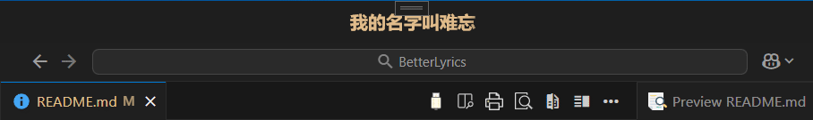
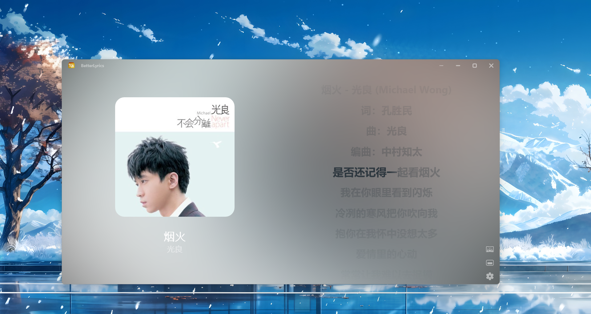
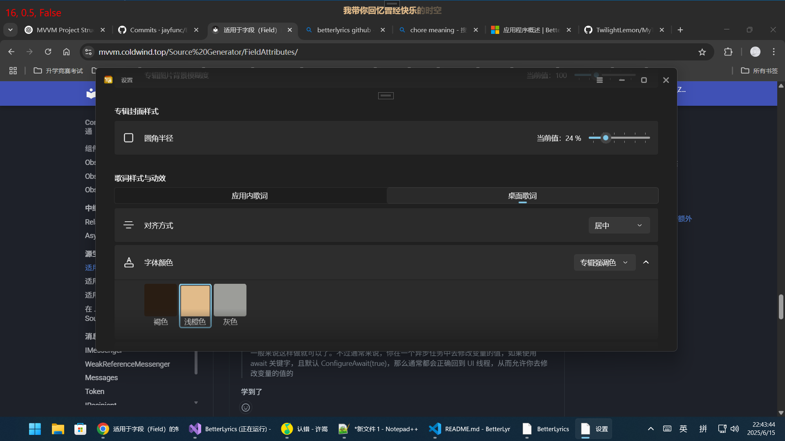

<div align="center">
  
</div>

<h2 align="center">
BetterLyrics
</div>

<h3 align="center">
Your smooth dynamic local lyrics display built with WinUI 3
</div>

---

## Highlighted features

- Dynamic blur album art as background
- Smooth lyrics fade in/out, zoom in/out effects
- Smooth user interface change from song to song
- Gradient Karaoke effect on every single character
- Immersive desktop lyrics

> This project is still under development now, bugs and unexpected behaviors may be existed in the latest dev branch.

## Customize in your way

We provide more than one setting item to better align with your preference

- Theme (light, dark, follow system)

- Backdrop (none, mica, acrylic, transparent)

- Album art as background (dynamic, blur amount, opacity)

- Lyrics (alignment, font size, font color **(picked from album art accent color)** line spacing, opacity, blur amount, dynamic **glow** effect)

- Language (English, Simplified Chinese, Traditional Chinese)

## Live demonstration




> **Highlighted feature**: Immersive lyrics shown on top of the screen (automatically follow current activated windows's accent color)

Or watch our introduction video「BetterLyrics 阶段性开发成果展示」(uploaded on 31 May 2025) on Bilibili [here](https://b23.tv/QjKkYmL).

## Screenshots

### In-app lyrics

Non-immersive mode



Immersive mode


Lyrics only


Fullscreen


### Desktop lyrics



## Try it now

### Stable version

<a href="https://apps.microsoft.com/detail/9P1WCD1P597R?referrer=appbadge&mode=direct">
	
</a>

> **Easiest** way to get it. **Unlimited** free trail or purchase (there is **no difference** between free and paid version, if you like you can purchase to support me)

Or alternatively get it from Google Drive (see [release](https://github.com/jayfunc/BetterLyrics/releases/latest) page for the link)

> Please note you are downloading ".zip" file, for guide on how to install it, please kindly follow [this doc](How2Install/How2Install.md).

### Latest dev version

You can `git clone` this project and build it yourself.

## Setup your app

This project relies on listening messages from [SMTC](https://learn.microsoft.com/en-ca/windows/uwp/audio-video-camera/integrate-with-systemmediatransportcontrols).
So technically, as long as you are using the music apps (like

- Spotify
- Groove Music
- Apple Music
- Windows Media Player
- VLC Media Player
- QQ 音乐
- 网易云音乐
- 酷狗音乐
- 酷我音乐

) which support SMTC, then possibly (I didn't test all of themif you find one fail to listen to, you can open an issue) all you need to do is just load your local music/lyrics lib and you are good to go.

## Future work

- Watching file changes
  When you downloading lyrics (using some other tools or your own scripts) while listening to new musics (non-existed on your local disks), this app can automatically load those new files.

> Please note: we are not planning support directly load lyrics files via some music software APIs due to copyright issues.

## Many thanks to

- [Audio Tools Library (ATL) for .NET](https://github.com/Zeugma440/atldotnet)
- [DevWinUI](https://github.com/ghost1372/DevWinUI)
- [Stackoverflow - How to animate Margin property in WPF](https://stackoverflow.com/a/21542882/11048731)
- [TagLib#](https://github.com/mono/taglib-sharp)
- [Bilibili -【WinUI3】SystemBackdropController：定义云母、亚克力效果](https://www.bilibili.com/video/BV1PY4FevEkS)
- [cnblogs - .NET App 与 Windows 系统媒体控制(SMTC)交互](https://www.cnblogs.com/TwilightLemon/p/18279496)
- [Win2D 中的游戏循环：CanvasAnimatedControl](https://www.cnblogs.com/walterlv/p/10236395.html)
- [r2d2rigo/Win2D-Samples](https://github.com/r2d2rigo/Win2D-Samples/blob/master/IrisBlurWin2D/IrisBlurWin2D/MainPage.xaml.cs)

## Inspired by

- [BetterNCM](https://github.com/std-microblock/BetterNCM)
- [Lyricify-App](https://github.com/WXRIW/Lyricify-App)
- [椒盐音乐 Salt Player](https://moriafly.com/program/salt-player)
- [MyToolBar](https://github.com/TwilightLemon/MyToolBar)

## Third-party libraries that this project uses

```
CommunityToolkit.Labs.WinUI.MarqueeText
CommunityToolkit.Labs.WinUI.OpacityMaskView
CommunityToolkit.Mvvm
CommunityToolkit.WinUI.Behaviors
CommunityToolkit.WinUI.Controls.Primitives
CommunityToolkit.WinUI.Controls.Segmented
CommunityToolkit.WinUI.Controls.SettingsControls
CommunityToolkit.WinUI.Converters
CommunityToolkit.WinUI.Extensions
CommunityToolkit.WinUI.Helpers
CommunityToolkit.WinUI.Media
Microsoft.Extensions.DependencyInjection
Microsoft.Extensions.Logging
Microsoft.Graphics.Win2D
Microsoft.Windows.SDK.BuildTools
Microsoft.WindowsAppSDK
Microsoft.Xaml.Behaviors.WinUI.Managed
Newtonsoft.Json
Serilog.Extensions.Logging
Serilog.Sinks.File
sqlite-net-pcl
System.Drawing.Common
System.Text.Encoding.CodePages
Ude.NetStandard
WinUIEx
z440.atl.core

```

## Star History

[](https://www.star-history.com/#jayfunc/BetterLyrics&Date)

## Any issues and PRs are welcomed

If you find a bug please file it in issues or if you have any ideas feel free to share it here.