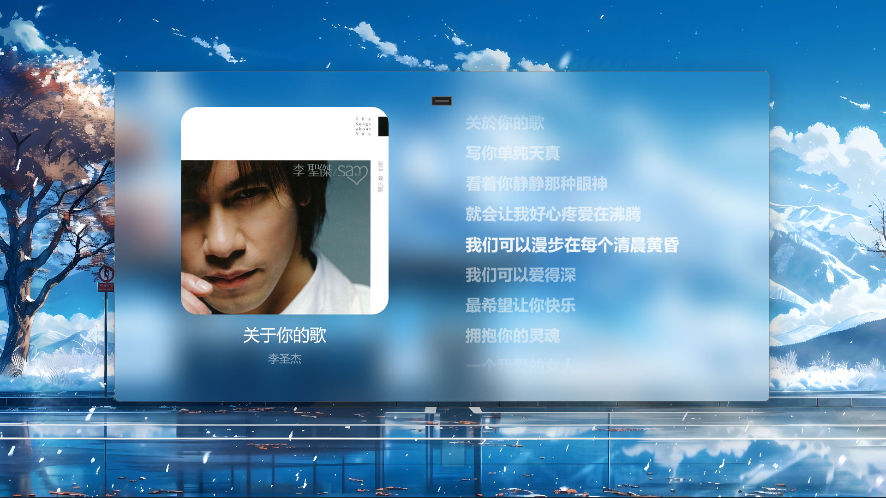
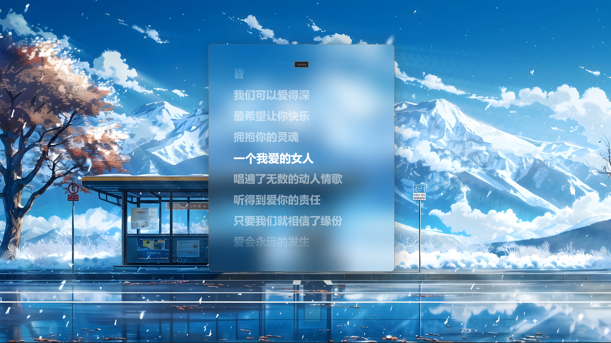

# BetterLyrics

Local song lyrics presentation app built with WinUI3

Coding in progress...

## Inspired by 
- [BetterNCM](https://github.com/std-microblock/BetterNCM)
- [Lyricify-App](https://github.com/WXRIW/Lyricify-App)

## Screenshots

## Many thanks to 
- [Audio Tools Library (ATL) for .NET](https://github.com/Zeugma440/atldotnet)
- [DevWinUI](https://github.com/ghost1372/DevWinUI)
- [Stackoverflow - How to animate Margin property in WPF](https://stackoverflow.com/a/21542882/11048731)
- [TagLib#](https://github.com/mono/taglib-sharp)
- [Lyricify Lyrics Helper](https://github.com/WXRIW/Lyricify-Lyrics-Helper)
- [Bilibili -【WinUI3】SystemBackdropController：定义云母、亚克力效果](https://www.bilibili.com/video/BV1PY4FevEkS)
- [cnblogs - .NET App 与Windows系统媒体控制(SMTC)交互](https://www.cnblogs.com/TwilightLemon/p/18279496)