**English** | [**中文**](README.CN.md)

  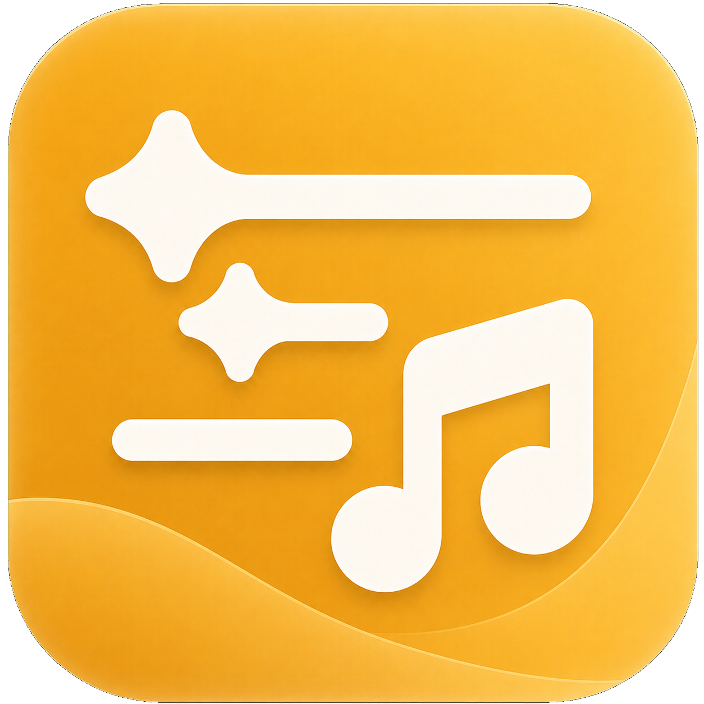
  
  <h1>BetterLyrics</h1>

  <h3>Strums the Heartstrings, Graces the Wordscapes</h4>

  <h4>
    An elegant and deeply customizable lyrics visualizer & versatile music player Built with WinUI3 / Win2D
  </h4>

  

    
    
    
    
  

  

    
    
    
    
  

   

  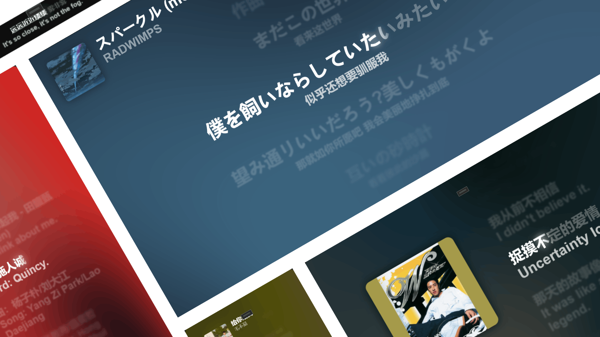
  
   
   

  

    
  

  

    
    
  

  

    
  

## 🔥 Community

[QQ Group 1](https://qm.qq.com/q/yArcw3n8pq) (1054700388) | [QQ Group 2](https://qm.qq.com/q/27rzSjFXt6) (1076554669) | [QQ Channel](https://pd.qq.com/s/1u1ntkyzr?b=9) (BetterLyrics4U) | [Discord](https://discord.gg/5yAQPnyCKv) | [Telegram](https://t.me/+svhSLZ7awPsxNGY1)

## 🧪 Download & Install

|                                                                                        Microsoft Store (Recommended)                                                                                         |                                                                             Manual Install                                                                              |
| :----------------------------------------------------------------------------------------------------------------------------------------------------------------------------------------------------------: | :---------------------------------------------------------------------------------------------------------------------------------------------------------------------: |
|  Unlimited free trial (Same as paid) | [**📦 Latest Release (.zip)**](https://github.com/jayfunc/BetterLyrics/releases/latest) See [Installation Guide](https://betterlyrics.github.io/get-started/install) |

[📖 Docs](https://betterlyrics.github.io) | [🧩 Plugin Store](https://betterlyrics.github.io/plugins-store) | [🔒 Privacy Policy](docs/PRIVACY_POLICY.md) | [⚖️ Terms of Service](docs/TERMS_OF_SERVICE.md)

## 🌟 Highlighted Features

- 🎨 **Stunning Visuals & Expressive Lyrics**
  - **Buttery-Smooth UI:** A modern experience powered by WinUI 3 & Win2D, featuring fluid animations and extensive personalization.
  - **Advanced Lyric Motion:** Every word breathes with the music. Includes **per-syllable highlighting**, **long-note duration glows**, and **perspective-based fading** for distant lines.
  - **Total Visual Control:** Beyond presets, you have full control to fine-tune lyric animations, fonts, and individual visual behaviors to match your unique taste.
  - **Immersive Backgrounds:** Beautiful visual effects including Dynamic Fluid, Blur, Fog, and Snowflake particles.
  - **Audio Visualizer:** Built-in real-time spectrum analyzer that brings your music to life.
  - **Lyrics Cards:** Generate and share gorgeous lyric cards with 10+ artistic themes (Vinyl, CD, Polaroid, Cyberpunk, and more).

- 🎧 **Smart Playback & Library Management**
  - **Versatile Player:** Play from **Local Drives** or stream via **SMB, WebDav, and FTP**. Features **playback memory** to resume where you left off.
  - **Live Library Sync:** A high-performance media library that stays in sync with your local folder changes in real-time.
  - **Universal Integration:** Seamlessly visualizes music from Spotify, Apple Music, NetEase, and [many other players](https://betterlyrics.github.io/player-cfg).
  - **Social Presence:** Show what you're looping with **Discord Rich Presence** and sync your journey via **Last.fm** scrobbling.

- 🌐 **Precision Lyrics & Plugin System**
  - **Smart Matching:** Accurate matching with **customizable thresholds**, manual metadata mapping, and persistent source memory.
  - **Lyrics Refinement:** Features **noise reduction** (filters non-lyric content) and **Simplified/Traditional Chinese conversion**.
  - **Modular Architecture:** A plugin system for community-driven expansion of lyric sources, translation engines, and transliteration tools (e.g., Romaji).
  - **Translation & AI Ready:** Built-in offline translation with a framework ready for **Local LLM** (AI) integration via plugins.
  - **Core Support:** Native handling of `.lrc` (Standard/Enhanced), `.eslrc`, and `.ttml` formats.

- 🪟 **Adaptive Modes for Every Setup**
  - **Standard / Full Screen:** For a pure, immersive focus on the music.
  - **Desktop / Wallpaper:** Floating "Always-on-Top" window or **embedded behind icons**—perfect for creative **Wallpaper Engine** setups.
  - **Docked:** A dedicated, sleek Appbar that snaps to the top or bottom edge of your screen.
  - **Narrow:** Optimized for vertical layouts, featuring track info at the top and a massive, high-density lyric area.
  - **Taskbar:** Save your desktop real estate by living directly inside the Windows Taskbar.

- 🧠 **Intelligence & Analytics**
  - **Smart Automation:** Automatically stays out of your way by hiding when the music stops.
  - **Stats Dashboard:** A beautiful analytics hub to track your play history and rediscover your top artists and tracks.

## 🖼️ Screenshots

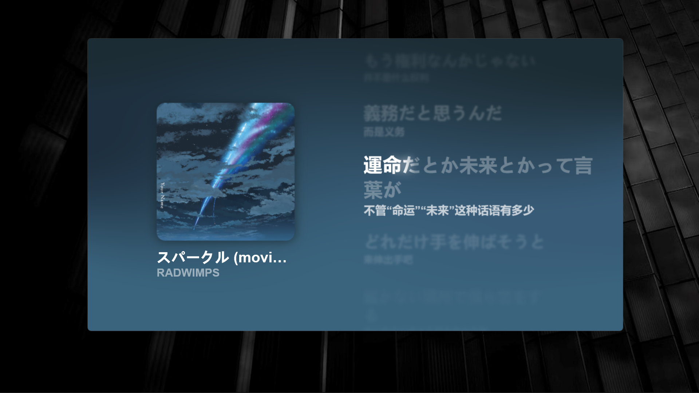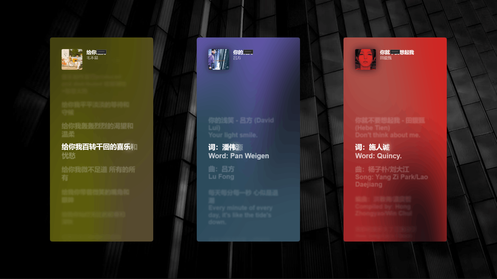
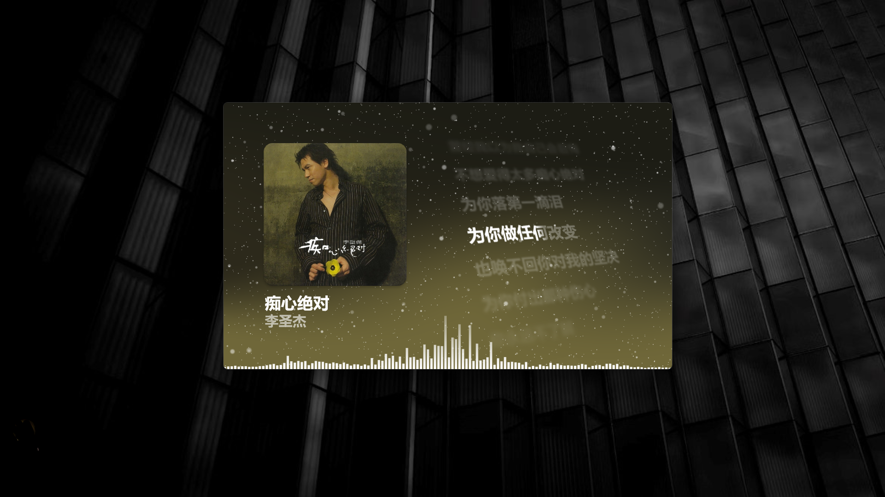

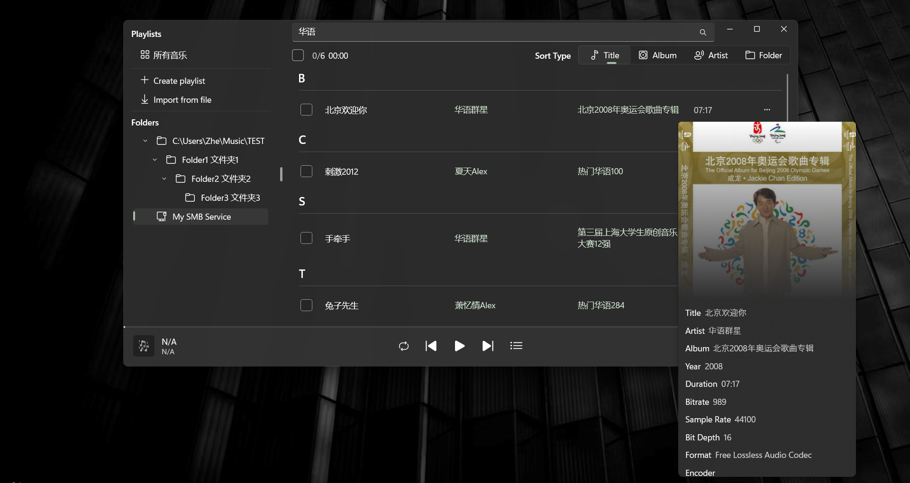

### 🎴 Lyrics Card

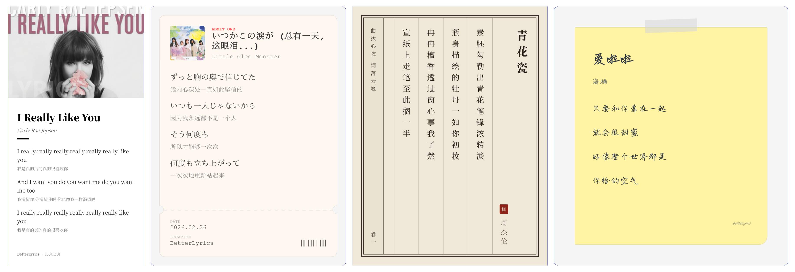

👉 Click here to see all the styles

### Classic Design

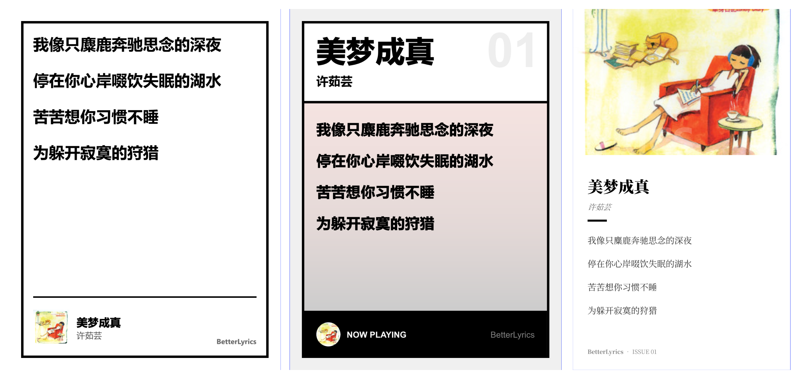

### Physical

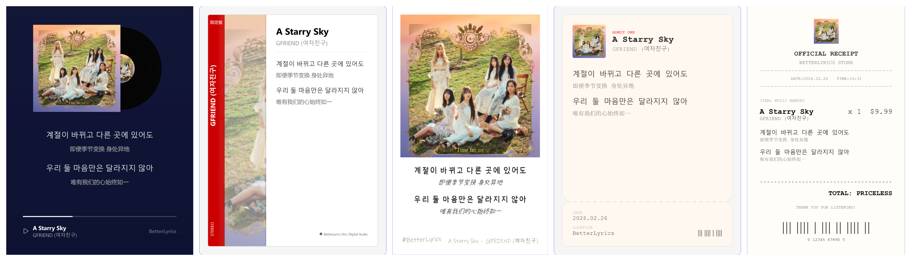

### Digital Retro

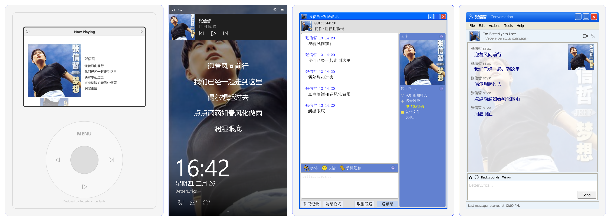

### Atmosphere

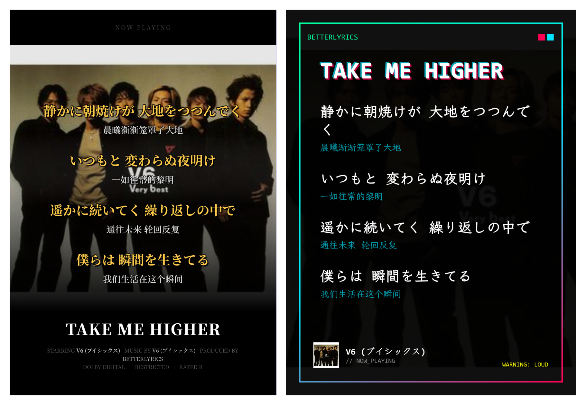

### Chinese Elegance

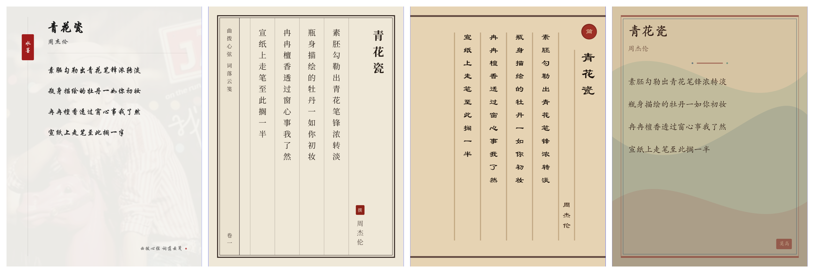

### Traces of Time

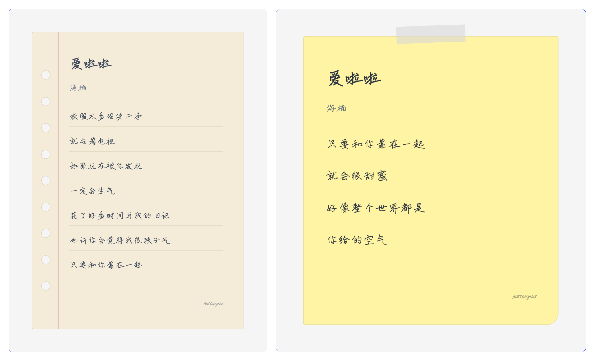

## 📹 Demonstration

> Watch our demo video (uploaded on 21 Oct 2025) on Bilibili [here](https://www.bilibili.com/video/BV1QRstz1EGt/).

## ✍️ Contribute & Build

**Help us translate:** Cannot find your language? [Start translating here](https://github.com/jayfunc/BetterLyrics?tab=contributing-ov-file).

**Develop Plugins:** Want to extend functionality? [Read the Developer Guide](https://betterlyrics.github.io/plugin-dev/intro/).

**Build from source:** [View build instructions](https://betterlyrics.github.io/get-started/download/#visual-studio)

## 🤑 Donations

If you like BetterLyrics, please consider supporting it. Your support helps keep the project alive!

|                                                                       Web Platforms                                                                       |                         Alipay/WeChat Pay                          |
| :-------------------------------------------------------------------------------------------------------------------------------------------------------: | :----------------------------------------------------------------: |
| [PayPal](https://paypal.me/zhefangpay)  [Buy Me a Coffee](https://buymeacoffee.com/founchoo)  [爱发电 (Afdian)](https://afdian.com/a/jayfunc) |  |

**[View the full Hall of Fame (Sponsors)](docs/SPONSORS.md)**

## ⭐ Star History

<a href="https://www.star-history.com/jayfunc/betterlyrics#history">
 <picture>
   <source media="(prefers-color-scheme: dark)" srcset="https://api.star-history.com/chart?repos=jayfunc/BetterLyrics&type=Date&theme=dark" />
   <source media="(prefers-color-scheme: light)" srcset="https://api.star-history.com/chart?repos=jayfunc/BetterLyrics&type=Date" />
   
 </picture>
</a>

## 📰 Media Mentions & Community Features

Discover what the community and media are saying about BetterLyrics! Check out our full [Media & Community Features List](docs/MEDIA.md).

## 📄 License & Credits

This project is licensed under the **GNU General Public License v3.0**.

## 💖 Special Thanks, Credits & Inspiration

### Acknowledgments

#### Contributors

- [jayfunc](https://github.com/jayfunc) `💻` `🌐` `🧪` `📝`
- [Raspberry-Monster](https://github.com/Raspberry-Monster) `💻`
- [zxbmmmmmmmmm](https://github.com/zxbmmmmmmmmm) `💻`
- [ZHider](https://github.com/ZHider) `💻`
- [YUZU384](https://github.com/YUZU384) `💻`
- [kusutori](https://github.com/kusutori) `💻`
- [PiYuanZhouLv](https://github.com/PiYuanZhouLv) `💻`
- [SuHeAndZl](https://crowdin.com/profile/SuHeAndZl) `🌐` `🧪` `📝`
- [borcolasky](https://crowdin.com/profile/borcolasky) `🌐`

> `💻` Code ╹ `🌐` i18n ╹ `🧪` QA ╹ `📝` Docs

#### Sponsors

- Special thanks to everyone who has supported the project through donations. For full details, please refer to the [Sponsors List (Hall of Fame)](docs/SPONSORS.md).

### Dependencies & References

| Projects/Packages                                                                         | Description                                                                      |
| :---------------------------------------------------------------------------------------- | :------------------------------------------------------------------------------- |
| [Isolation](https://github.com/Storyteller-Studios/Isolation)                             | Dynamic fluid background implementation                                          |
| [LibreTranslate](https://github.com/LibreTranslate/LibreTranslate)                        | Provide the ability for offline lyrics translation                               |
| [lrclib](https://github.com/tranxuanthang/lrclib)                                         | LRCLIB lyrics API provider                                                       |
| [Lyricify-Lyrics-Helper](https://github.com/WXRIW/Lyricify-Lyrics-Helper)                 | Provide lyrics fetch, decryption, and parsing for QQ, Netease, and Kugou sources |
| [Manzana-Apple-Music-Lyrics](https://github.com/dropcreations/Manzana-Apple-Music-Lyrics) | Apple Music lyrics fetch using Python                                            |
| [SpectrumVisualization](https://github.com/Johnwikix/SpectrumVisualization)               | Audio visualization reference                                                    |

See [dependencies](https://github.com/jayfunc/BetterLyrics/network/dependencies) for the full list.

### Inspired by

Some design ideas are referenced from the following projects (design inspiration only):

- [refined-now-playing-netease](https://github.com/solstice23/refined-now-playing-netease) `FOSS`
- [Lyricify-App](https://github.com/WXRIW/Lyricify-App) `Prop`
- [Salt Player for Windows](https://moriafly.com/program/spw.html) `💰` `Prop`
- [MyToolBar](https://github.com/TwilightLemon/MyToolBar) `FOSS`

> `FOSS` Free and Open Source Software ╹ `Prop` Proprietary ╹ `💰` Paid

## 💭 Share on Social Media

<b>Click to expand</b>

 

  
  /jayfunc/BetterLyrics" width="48%">

 

  <mark><i>This project is under active development; unexpected issues may occur.</i></mark> 
  Disclaimer: This project is provided "as is". All third-party resources belong to their respective owners.

