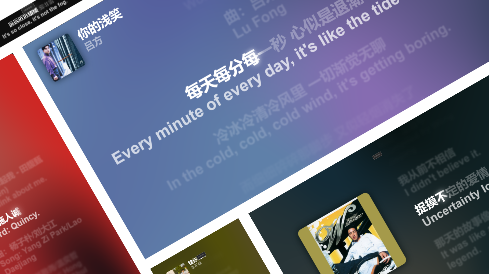
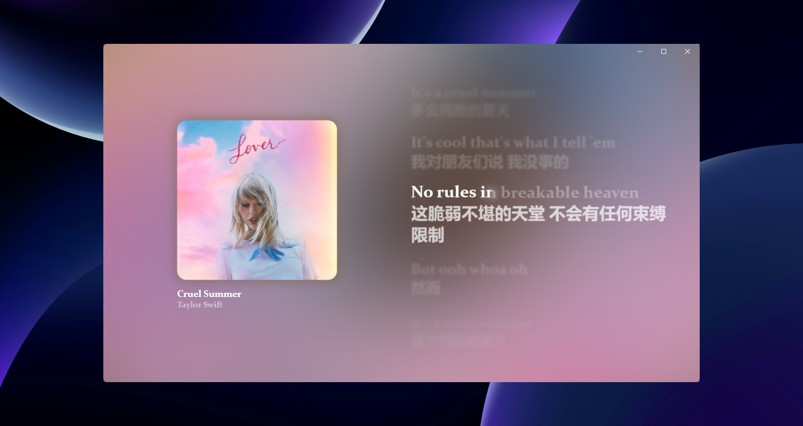
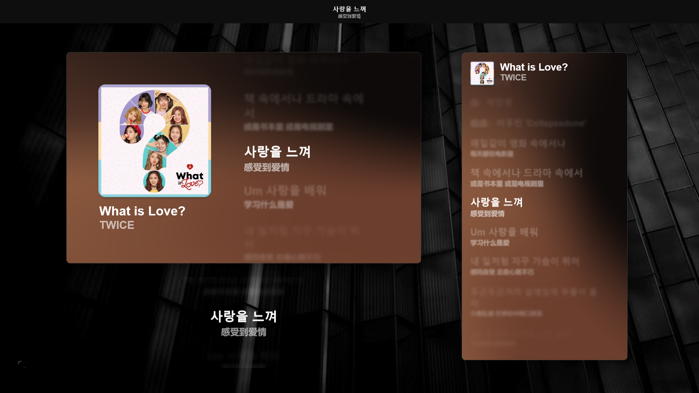
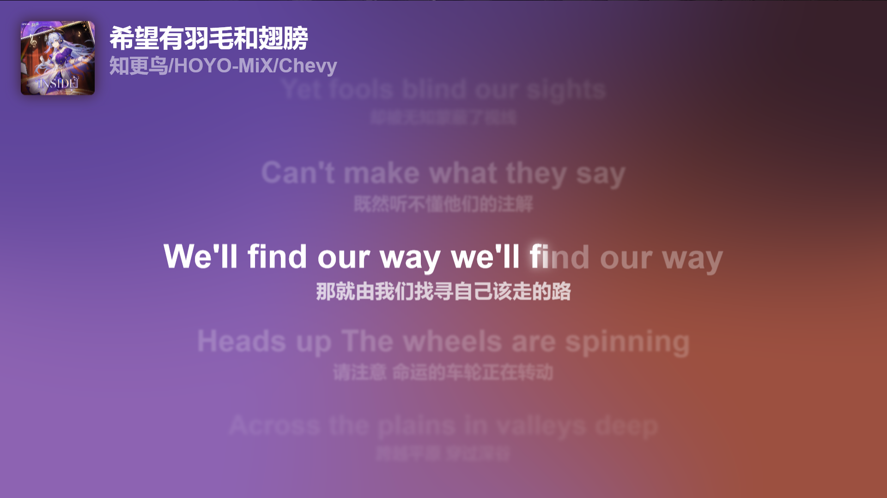
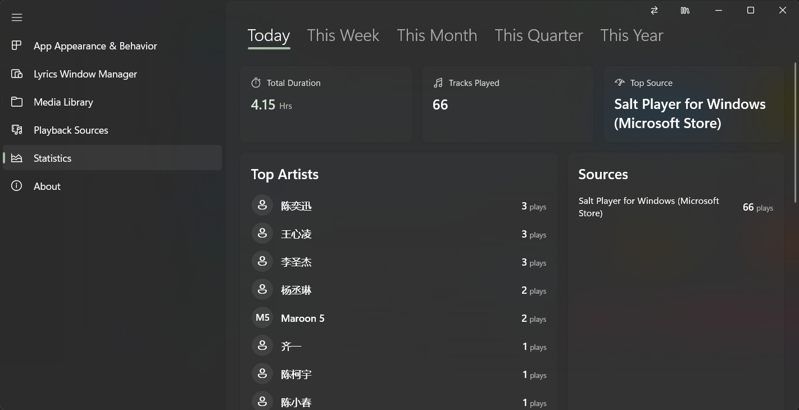

[**中文**](README.CN.md) | [**English**](README.md)

  
  
  <h1>BetterLyrics</h1>

  <h4>
    🤩 An elegant and deeply customizable lyrics visualizer & versatile music player  
    Built with WinUI3 / Win2D
  </h4>

  

    
    
    
    
    
  

   

  

 

## 🔥 Featured & Community

| Featured by HelloGitHub | Featured by SSPAI | 🤖 Ask AI |
| :---: | :---: | :---: |
|  | [**Read the Review Article**](https://sspai.com/post/101028) |    [![Zread](https://img.shields.io/badge/Ask_Zread-_.svg?style=flat&color=00b0aa&labelColor=000000&logo=data%3Aimage%2Fsvg%2Bxml%3Bbase64%2CPHN2ZyB3aWR0aD0iMTYiIGhlaWdodD0iMTYiIHZpZXdCb3g9IjAgMCAxNiAxNiIgZmlsbD0ibm9uZSIgeG1sbnM9Imh0dHA6Ly93d3cudzMub3JnLzIwMDAvc3ZnIj4KPHBhdGggZD0iTTQuOTYxNTYgMS42MDAxSDIuMjQxNTZDMS44ODgxIDEuNjAwMSAxLjYwMTU2IDEuODg2NjQgMS42MDE1NiAyLjI0MDFWNC45NjAxQzEuNjAxNTYgNS4zMTM1NiAxLjg4ODEgNS42MDAxIDIuMjQxNTYgNS42MDAxSDQuOTYxNTZDNS4zMTUwMiA1LjYwMDEgNS42MDE1NiA1LjMxMzU2IDUuNjAxNTYgNC45NjAxVjIuMjQwMUM1LjYwMTU2IDEuODg2NjQgNS4zMTUwMiAxLjYwMDEgNC45NjE1NiAxLjYwMDFaIiBmaWxsPSIjZmZmIi8%2BCjxwYXRoIGQ9Ik00Ljk2MTU2IDEwLjM5OTlIMi4yNDE1NkMxLjg4ODEgMTAuMzk5OSAxLjYwMTU2IDEwLjY4NjQgMS42MDE1NiAxMS4wMzk5VjEzLjc1OTlDMS42MDE1NiAxNC4xMTM0IDEuODg4MSAxNC4zOTk5IDIuMjQxNTYgMTQuMzk5OUg0Ljk2MTU2QzUuMzE1MDIgMTQuMzk5OSA1LjYwMTU2IDE0LjExMzQgNS42MDE1NiAxMy43NTk5VjExLjAzOTlDNS42MDE1NiAxMC42ODY0IDUuMzE1MDIgMTAuMzk5OSA0Ljk2MTU2IDEwLjM5OTlaIiBmaWxsPSIjZmZmIi8%2BCjxwYXRoIGQ9Ik0xMy43NTg0IDEuNjAwMUgxMS4wMzg0QzEwLjY4NSAxLjYwMDEgMTAuMzk4NCAxLjg4NjY0IDEwLjM5ODQgMi4yNDAxVjQuOTYwMUMxMC4zOTg0IDUuMzEzNTYgMTAuNjg1IDUuNjAwMSAxMS4wMzg0IDUuNjAwMUgxMy43NTk5QzE0LjExMTkgNS42MDAxIDE0LjM5ODQgNS4zMTM1NiAxNC4zOTg0IDQuOTYwMVYyLjI0MDFDMTQuMzk4NCAxLjg4NjY0IDE0LjExMTkgMS42MDAxIDEzLjc1ODQgMS42MDAxWiIgZmlsbD0iI2ZmZiIvPgo8cGF0aCBkPSJNNCAxMkwxMiA0TDQgMTJaIiBmaWxsPSIjZmZmIi8%2BCjxwYXRoIGQ9Ik00IDEyTDEyIDQiIHN0cm9rZT0iI2ZmZiIgc3Ryb2tlLXdpZHRoPSIxLjUiIHN0cm9rZS1saW5lY2FwPSJyb3VuZCIvPgo8L3N2Zz4K&logoColor=ffffff)](https://zread.ai/jayfunc/BetterLyrics) |

**Chat Groups:** [QQ Group (1054700388)](https://qun.qq.com/universal-share/share?ac=1&authKey=4Q%2BYTq3wZldYpF5SbS5c19ECFsiYoLZFAIcBNNzYpBUtiEjaZ8sZ%2F%2BnFN0qw3lad&busi_data=eyJncm91cENvZGUiOiIxMDU0NzAwMzg4IiwidG9rZW4iOiJiVnhqemVYN0N5QVc3b1ZkR24wWmZOTUtvUkJoWm1JRWlaWW5iZnlBcXJtZUtGc2FFTHNlUlFZMi9iRm03cWF5IiwidWluIjoiMTM5NTczOTY2MCJ9&data=39UmAihyH_o6CZaOs7nk2mO_lz2ruODoDou6pxxh7utcxP4WF5sbDBDOPvZ_Wqfzeey4441anegsLYQJxkrBAA&svctype=4&tempid=h5_group_info) | [QQ Channel (BetterLyrics4U)](https://pd.qq.com/s/1u1ntkyzr?b=9) | [Discord](https://discord.gg/5yAQPnyCKv) | [Telegram](https://t.me/+svhSLZ7awPsxNGY1)

## 🧪 Download & Install

| Microsoft Store (Recommended) | Manual Install |
| :---: | :---: |
|  Unlimited free trial (Same as paid) | [**📦 Latest Release (.zip)**](https://github.com/jayfunc/BetterLyrics/releases/latest) See [Installation Guide](https://jayfunc.blog/blog/how-to-install-zip) |

[📖 User Guide](https://github.com/jayfunc/BetterLyrics/wiki/User-Guide) | [🔒 Privacy Policy](PrivacyPolicy.md) | [⚖️ Terms of Service](TermsofService.md)

## 🌟 Highlighted Features

- 🎨 **Stunning Visuals & UI**
  - **Elegant Design:** Smooth, highly personalized style powered by WinUI3 & Win2D.
  - **Immersive Effects:** Fluid backgrounds, 3D/Fan-shaped lyrics, snowflake particles, and more.
  - **Deep Customization:** Configure animations, fonts, and behaviors to your taste.

- 🎧 **Versatile Playback & Connectivity**
  - **Built-in Player:** Play from **Local Drives** or stream via **Network Protocols** (SMB, WebDAV).
  - **External Integration:** Visualizes music from Spotify, Apple Music, NetEase, and [many others](https://github.com/jayfunc/BetterLyrics/wiki/User-Guide#known-supported-music-players-configuration-guide).

- 🌐 **Advanced Lyrics System**
  - **Offline Translation:** Privacy-focused local machine translation (30+ languages).
  - **Comprehensive Sources:** .lrc (Standard/Enhanced), .eslrc, .ttml, embedded tags, and online sources (QQ Music, NetEase, LRCLIB).
  - **Apple Music:** Supports lyrics fetching (Requires token configuration).

- 🪟 **Display Modes for Every Scenario**
  - **Standard:** Full immersive experience.
  - **Docked:** A sleek bar attached to your screen edge.
  - **Desktop Overlay:** Lyrics floating above all apps.

- 🧠 **Smart Behaviors**
  - Auto-hides when music pauses.

## 🖼️ Screenshots

| Standard View | Narrow Mode |
| :---: | :---: |
|  |  |

| Lyrics Visual Effects | Coexisting Modes |
| :---: | :---: |
|  |  |

| Fullscreen Mode | Fullscreen Mode |
| :---: | :---: |
|  |  |

| Music Gallery | Playback Statistics |
| :---: | :---: |
|  |  |

## 📹 Demonstration

> Watch our demo video (uploaded on 21 Oct 2025) on Bilibili [here](https://www.bilibili.com/video/BV1QRstz1EGt/).

## ✍️ Contribute & Build

**Help us translate:** Cannot find your language? [Start translating here](https://github.com/jayfunc/BetterLyrics?tab=contributing-ov-file).

**Build from source:**
> Before building, ensure you have replaced `DiscordTemplate.cs` and `LastFM.cs` in the `Constants` folder.

## 🤑 Donations

If you like BetterLyrics, please consider supporting it. Your support helps keep the project alive!

| Web Platforms | Alipay (QR) | WeChat (QR) |
| :---: | :---: | :---: |
| [PayPal](https://paypal.me/zhefangpay)  [Buy Me a Coffee](https://buymeacoffee.com/founchoo)  [爱发电 (Afdian)](https://afdian.com/a/jayfunc) |  |  |

**[View the full Hall of Fame (Sponsors)](SPONSORS.md)**

## ⭐ Star History

  

## 📄 License & Credits

This project is licensed under the **GNU General Public License v3.0**.

<b>💖 Special Thanks, Credits & Inspiration</b>

 

**Dependencies & References:**

| Projects/Packages | Description |
| :--- | :--- |
| [Audio Tools Library (ATL) for .NET](https://github.com/Zeugma440/atldotnet) | Used for extracting pictures from music files |
| [cutlet](https://github.com/polm/cutlet) | Provide the ability for converting Japanese to romaji |
| [DevWinUI](https://github.com/ghost1372/DevWinUI) | Provide many out-of-the-box features for building WinUI 3 applications |
| [Isolation](https://github.com/Storyteller-Studios/Isolation) | Dynamic fluid background implementation |
| [LibreTranslate](https://github.com/LibreTranslate/LibreTranslate) | Provide the ability for offline lyrics translation |
| [lrclib](https://github.com/tranxuanthang/lrclib) | LRCLIB lyrics API provider |
| [Lyricify-Lyrics-Helper](https://github.com/WXRIW/Lyricify-Lyrics-Helper) | Provide lyrics fetch, decryption, and parsing for QQ, Netease, and Kugou sources |
| [Manzana-Apple-Music-Lyrics](https://github.com/dropcreations/Manzana-Apple-Music-Lyrics) | Apple Music lyrics fetch using Python |
| [SpectrumVisualization](https://github.com/Johnwikix/SpectrumVisualization) | Audio visualization reference |
| [TagLib#](https://github.com/mono/taglib-sharp) | Used for reading the original lyrics content |
| [Vanara](https://github.com/dahall/Vanara) | Win32 API wrapper |
| [WinUIEx](https://github.com/dotMorten/WinUIEx) | Provide easy ways to access the Win32 API regarding windowing |

See [dependencies](https://github.com/jayfunc/BetterLyrics/network/dependencies) for full list.

 

**💡 Inspired by:**

Some design ideas are referenced from the following projects (design inspiration only):
- [refined-now-playing-netease](https://github.com/solstice23/refined-now-playing-netease)
- [Lyricify-App](https://github.com/WXRIW/Lyricify-App)
- [Salt Player](https://moriafly.com/program/salt-player)
- [MyToolBar](https://github.com/TwilightLemon/MyToolBar)

## 💭 Share on Social Media

<b>Click to expand</b>

 

  
  /jayfunc/BetterLyrics" width="48%">

 

  <mark><i>This project is under active development; unexpected issues may occur.</i></mark> 
  Disclaimer: This project is provided "as is". All third-party resources belong to their respective owners.

