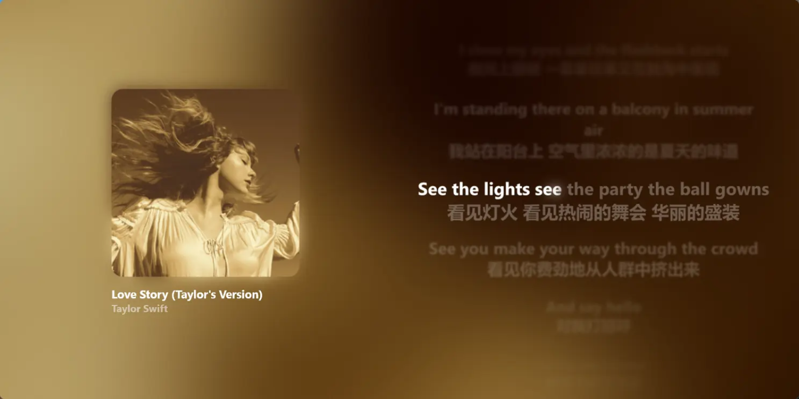
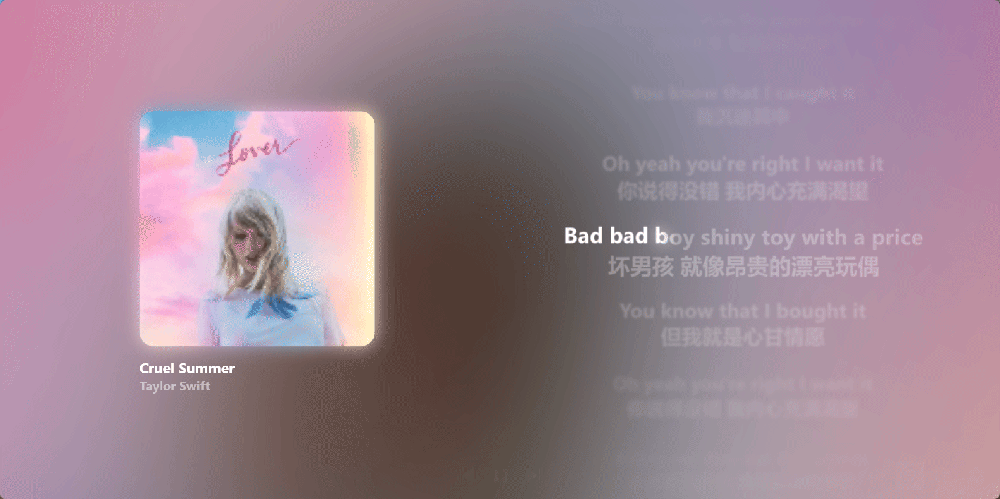
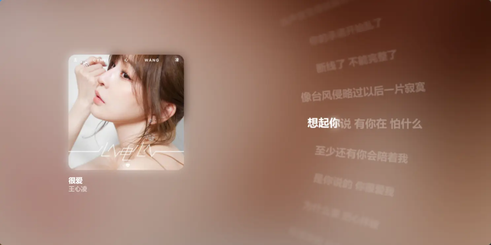
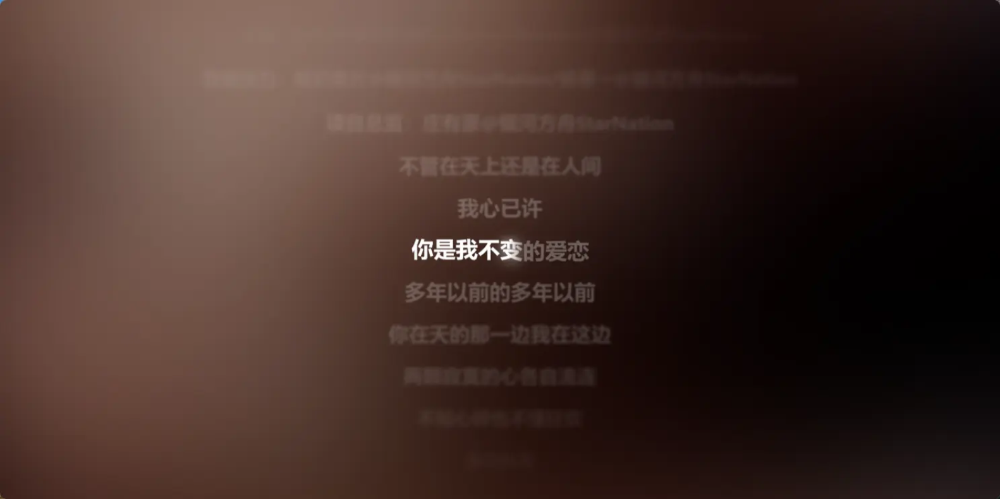
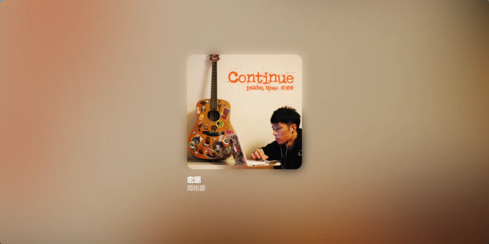
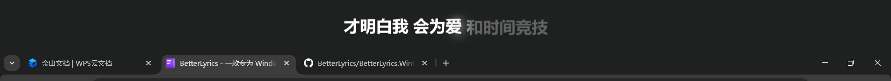
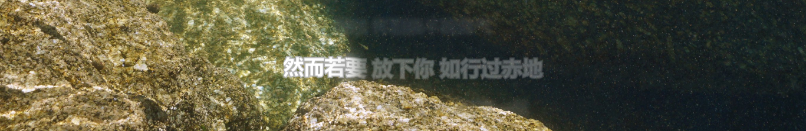

<a href="https://github.com/jayfunc/BetterLyrics/blob/dev/README.CN.md">_**🌐点此处查看中文说明**_</a>

<a href="https://github.com/jayfunc/BetterLyrics/blob/dev/FAQ/FAQ.md">_**❓Click here to view frequently asked questions (FAQ)**_</a>

  

<h2 align="center">
BetterLyrics
</h2>
<h4 align="center">
Your smooth dynamic lyrics display tool built with WinUI 3
</h3>

## 🎉 This project was featured by SSPAI!
Check out the article: [BetterLyrics – An immersive and smooth lyrics display tool designed for Windows](https://sspai.com/post/101028)

## Feedback and chat group

- [「BetterLyrics」反馈交流群（简体中文）](https://qun.qq.com/universal-share/share?ac=1&authKey=4Q%2BYTq3wZldYpF5SbS5c19ECFsiYoLZFAIcBNNzYpBUtiEjaZ8sZ%2F%2BnFN0qw3lad&busi_data=eyJncm91cENvZGUiOiIxMDU0NzAwMzg4IiwidG9rZW4iOiJiVnhqemVYN0N5QVc3b1ZkR24wWmZOTUtvUkJoWm1JRWlaWW5iZnlBcXJtZUtGc2FFTHNlUlFZMi9iRm03cWF5IiwidWluIjoiMTM5NTczOTY2MCJ9&data=39UmAihyH_o6CZaOs7nk2mO_lz2ruODoDou6pxxh7utcxP4WF5sbDBDOPvZ_Wqfzeey4441anegsLYQJxkrBAA&svctype=4&tempid=h5_group_info) (1054700388) on QQ
- [「BetterLyrics」Feedback Chat Group (Traditional Chinese / English)](https://discord.gg/5yAQPnyCKv) on Discord

## Highlighted features

- Dynamic blur album art as background
- Smooth lyrics fade in/out, zoom in/out effects
- Smooth user interface change from song to song
- Gradient Karaoke (with glow) effect on every single character
- Immersive desktop lyrics (dock mode)
- Local translation (supporting 30 languages)

> This project is still under development, bugs and unexpected behaviors may be existed in the latest branch.

## Supported lyrics source

- From your local storage
  - Music files (with embedded lyrics)
  - [.lrc](<https://en.wikipedia.org/wiki/LRC_(file_format)>) files (with both core format and enhanced format)
  - [.eslrc](https://github.com/ESLyric/release) files
  - [.ttml](https://en.wikipedia.org/wiki/Timed_Text_Markup_Language) files

(For lyrics downloading, you can use [LDDC](https://github.com/chenmozhijin/LDDC))

- From online lyrics providers
  - QQ Music
  - 网易云音乐 NetEase Cloud Music
  - 酷狗音乐 Kugou Music
  - [amll-ttml-db](https://github.com/Steve-xmh/amll-ttml-db)
  - [LRCLIB](https://lrclib.net/)

## Screenshots

### Standard mode

### Dock mode

### Desktop mode

## Demonstration

Watch our introduction video (uploaded on 7 July 2025) on Bilibili [here](https://www.bilibili.com/video/BV1zjGjzfEXh).

## Tested music player

- Kugou Music
  - No timeline information broadcasted, which means when you change timeline position in Kugou Music, BetterLyrics has no way to detect this change. 
- Apple Music
  - Make sure you have set timeline threshold to around 600 ms in settings (Go to "Settings" - "Advanced option" to change), otherwise, the lyrics will be moving forward and afterward constantly.
- foobar2000
  - Make sure you have https://github.com/dumbie/foo_mediacontrol installed with it
- Spofity
- QQ Music
- PotPlayer
- Media Player (System)
- PotPlayer
- LX Music

## Try it now

### Microsoft Store

**Easiest** way to get it. **Unlimited** free trail or purchase (there is **no difference** between free and paid version)

☕ If you find it helpful, please consider purchasing 🧧 it in **Microsoft Store**, I'll appreciate it! 🥰

> Please note that the version in Microsoft Store may not be the latest.

### Google Drive

Wanna try the **latest** version? get it from Google Drive (see [release](https://github.com/jayfunc/BetterLyrics/releases) page for the link)

> Please note you are downloading ".zip" file, for guide on how to install it, please kindly follow [this doc](How2Install/How2Install.md).

## Many thanks to

- [Lyricify-Lyrics-Helper](https://github.com/WXRIW/Lyricify-Lyrics-Helper)
  - Provide lyrics fetch, decryption, and parse for QQ, Netease, Kugou sources
- [LRCLIB](https://lrclib.net/)
  - LRCLIB lyrics API provider
- [Audio Tools Library (ATL) for .NET](https://github.com/Zeugma440/atldotnet)
  - Used for extracting pictures in music files
- [WinUIEx](https://github.com/dotMorten/WinUIEx)
  - Provide easy ways to access Win32 API regarding windowing
- [TagLib#](https://github.com/mono/taglib-sharp)
  - Used for reading original lyrics content
- [Vanara](https://github.com/dahall/Vanara)
  - Win32 API wrapper
- [Stackoverflow - How to animate Margin property in WPF](https://stackoverflow.com/a/21542882/11048731)
- [DevWinUI](https://github.com/ghost1372/DevWinUI)
- [Bilibili -【WinUI3】SystemBackdropController：定义云母、亚克力效果](https://www.bilibili.com/video/BV1PY4FevEkS)
- [cnblogs - .NET App 与 Windows 系统媒体控制(SMTC)交互](https://www.cnblogs.com/TwilightLemon/p/18279496)
- [Win2D 中的游戏循环：CanvasAnimatedControl](https://www.cnblogs.com/walterlv/p/10236395.html)
- [r2d2rigo/Win2D-Samples](https://github.com/r2d2rigo/Win2D-Samples/blob/master/IrisBlurWin2D/IrisBlurWin2D/MainPage.xaml.cs)
- [CommunityToolkit - 从入门到精通](https://mvvm.coldwind.top/)

## Inspired by

- [refined-now-playing-netease](https://github.com/solstice23/refined-now-playing-netease)
- [Lyricify-App](https://github.com/WXRIW/Lyricify-App)
- [椒盐音乐 Salt Player](https://moriafly.com/program/salt-player)
- [MyToolBar](https://github.com/TwilightLemon/MyToolBar)

## Star History

## Any issues and PRs are welcomed

If you find a bug please file it in issues or if you have any ideas feel free to share it here.
