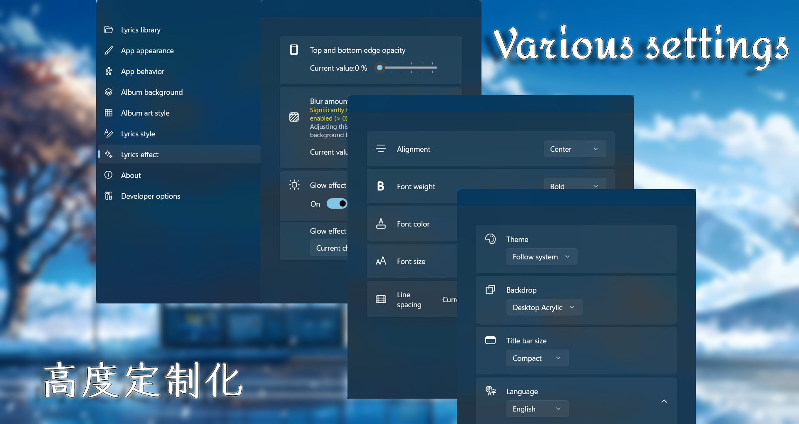

<a href="https://github.com/jayfunc/BetterLyrics/blob/dev/README.CN.md">_**点此处查看中文说明**_</a>

<div align="center">
  
</div>

<h2 align="center">
BetterLyrics
</div>

<h3 align="center">
Your smooth dynamic local lyrics display built with WinUI 3
</div>

---

## Highlighted features

- Dynamic blur album art as background
- Smooth lyrics fade in/out, zoom in/out effects
- Smooth user interface change from song to song
- Gradient Karaoke (with glow) effect on every single character
- Immersive desktop lyrics (dock mode)

> This project is still under development now, bugs and unexpected behaviors may be existed in the latest dev branch.

## Supported lyrics source

- From your local storage
  - Music files (with embedded lyrics) (Read and parsed by [Audio Tools Library (ATL) for .NET](https://github.com/Zeugma440/atldotnet))
  - .lrc files

- From online lyrics providers
  - [LRCLIB](https://lrclib.net/)
  - QQ Music (Fetch and decoded by [Lyricify-Lyrics-Helper](https://github.com/WXRIW/Lyricify-Lyrics-Helper))

## Customize in your way

We provide more than one setting item to better align with your preference

- Theme (light, dark, follow system)

- Backdrop (none, mica, acrylic, transparent)

- Album art as background (dynamic, blur amount, opacity)

- Lyrics (alignment, font size, font color **(picked from album art accent color)** line spacing, opacity, blur amount, dynamic **glow** effect)

- Language (English, Simplified Chinese, Traditional Chinese)


## Screenshots





## Demonstration

Watch our introduction video「BetterLyrics 阶段性开发成果展示」(uploaded on 31 May 2025) on Bilibili [here](https://b23.tv/QjKkYmL).

## Try it now

### Stable version

<a href="https://apps.microsoft.com/detail/9P1WCD1P597R?referrer=appbadge&mode=direct">
	
</a>

> **Easiest** way to get it. **Unlimited** free trail or purchase (there is **no difference** between free and paid version, if you like you can purchase to support me)

Or alternatively get it from Google Drive (see [release](https://github.com/jayfunc/BetterLyrics/releases/latest) page for the link)

> Please note you are downloading ".zip" file, for guide on how to install it, please kindly follow [this doc](How2Install/How2Install.md).

### Latest dev version

You can `git clone` this project and build it yourself.

## Setup your app

This project relies on listening messages from [SMTC](https://learn.microsoft.com/en-ca/windows/uwp/audio-video-camera/integrate-with-systemmediatransportcontrols).
So technically, as long as you are using the music apps (like

- Spotify
- Groove Music
- Apple Music
- Windows Media Player
- VLC Media Player
- QQ 音乐
- 酷狗音乐
- 酷我音乐

) which support SMTC, then possibly (I didn't test all of themif you find one fail to listen to, you can open an issue) all you need to do is just load your local music/lyrics lib and you are good to go.

## Future work

To be added later.

## Many thanks to

- [LRCLIB](https://lrclib.net/)
  - Online lyrics API provider
- [Audio Tools Library (ATL) for .NET](https://github.com/Zeugma440/atldotnet)
  - Local music file metadata extractor
- [WinUIEx](https://github.com/dotMorten/WinUIEx)
  - Provide easy ways to access Win32 API regarding windowing
- [TagLib#](https://github.com/mono/taglib-sharp)
  - Previously used it as metadata extractor
- [Stackoverflow - How to animate Margin property in WPF](https://stackoverflow.com/a/21542882/11048731)
- [DevWinUI](https://github.com/ghost1372/DevWinUI)
- [Bilibili -【WinUI3】SystemBackdropController：定义云母、亚克力效果](https://www.bilibili.com/video/BV1PY4FevEkS)
- [cnblogs - .NET App 与 Windows 系统媒体控制(SMTC)交互](https://www.cnblogs.com/TwilightLemon/p/18279496)
- [Win2D 中的游戏循环：CanvasAnimatedControl](https://www.cnblogs.com/walterlv/p/10236395.html)
- [r2d2rigo/Win2D-Samples](https://github.com/r2d2rigo/Win2D-Samples/blob/master/IrisBlurWin2D/IrisBlurWin2D/MainPage.xaml.cs)
- [CommunityToolkit - 从入门到精通](https://mvvm.coldwind.top/)

## Inspired by

- [refined-now-playing-netease](https://github.com/solstice23/refined-now-playing-netease)
- [Lyricify-App](https://github.com/WXRIW/Lyricify-App)
- [椒盐音乐 Salt Player](https://moriafly.com/program/salt-player)
- [MyToolBar](https://github.com/TwilightLemon/MyToolBar)

## Third-party libraries that this project uses

```
    <PackageReference Include="CommunityToolkit.Labs.WinUI.MarqueeText" Version="0.1.230830" />
    <PackageReference
      Include="CommunityToolkit.Labs.WinUI.OpacityMaskView"
      Version="0.1.250513-build.2126"
    />
    <PackageReference Include="CommunityToolkit.Mvvm" Version="8.4.0" />
    <PackageReference Include="CommunityToolkit.WinUI.Behaviors" Version="8.2.250402" />
    <PackageReference Include="CommunityToolkit.WinUI.Controls.Primitives" Version="8.2.250402" />
    <PackageReference Include="CommunityToolkit.WinUI.Controls.Segmented" Version="8.2.250402" />
    <PackageReference
      Include="CommunityToolkit.WinUI.Controls.SettingsControls"
      Version="8.2.250402"
    />
    <PackageReference Include="CommunityToolkit.WinUI.Converters" Version="8.2.250402" />
    <PackageReference Include="CommunityToolkit.WinUI.Extensions" Version="8.2.250402" />
    <PackageReference Include="CommunityToolkit.WinUI.Helpers" Version="8.2.250402" />
    <PackageReference Include="CommunityToolkit.WinUI.Media" Version="8.2.250402" />
    <PackageReference Include="Lyricify.Lyrics.Helper" Version="0.1.4" />
    <PackageReference Include="Microsoft.Extensions.DependencyInjection" Version="9.0.6" />
    <PackageReference Include="Microsoft.Extensions.Logging" Version="9.0.6" />
    <PackageReference Include="Microsoft.Graphics.Win2D" Version="1.3.2" />
    <PackageReference Include="Microsoft.Windows.SDK.BuildTools" Version="10.0.26100.4188" />
    <PackageReference Include="Microsoft.WindowsAppSDK" Version="1.7.250606001" />
    <PackageReference Include="Microsoft.Xaml.Behaviors.WinUI.Managed" Version="3.0.0" />
    <PackageReference Include="Newtonsoft.Json" Version="13.0.3" />
    <PackageReference Include="Serilog.Extensions.Logging" Version="9.0.2" />
    <PackageReference Include="Serilog.Sinks.File" Version="7.0.0" />
    <PackageReference Include="System.Drawing.Common" Version="9.0.6" />
    <PackageReference Include="System.Text.Encoding.CodePages" Version="9.0.6" />
    <PackageReference Include="Ude.NetStandard" Version="1.2.0" />
    <PackageReference Include="WinUIEx" Version="2.5.1" />
    <PackageReference Include="z440.atl.core" Version="6.25.0" />
```

## Star History

[](https://www.star-history.com/#jayfunc/BetterLyrics&Date)

## Any issues and PRs are welcomed

If you find a bug please file it in issues or if you have any ideas feel free to share it here.
