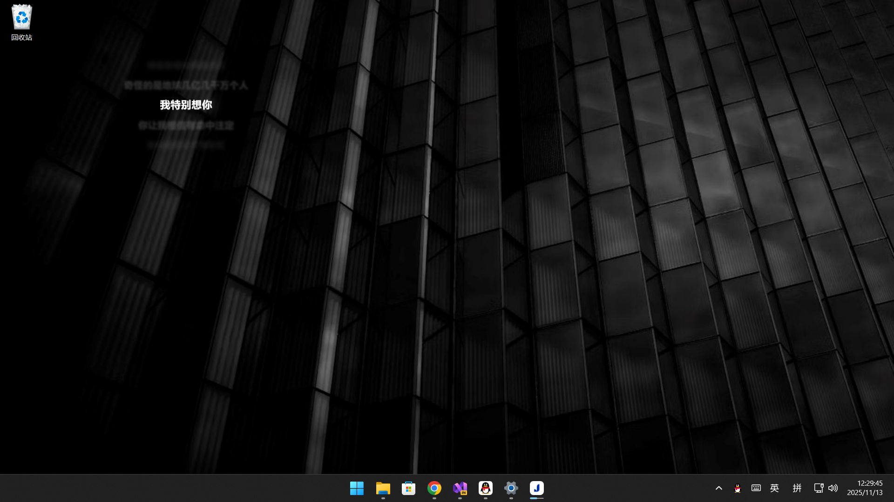
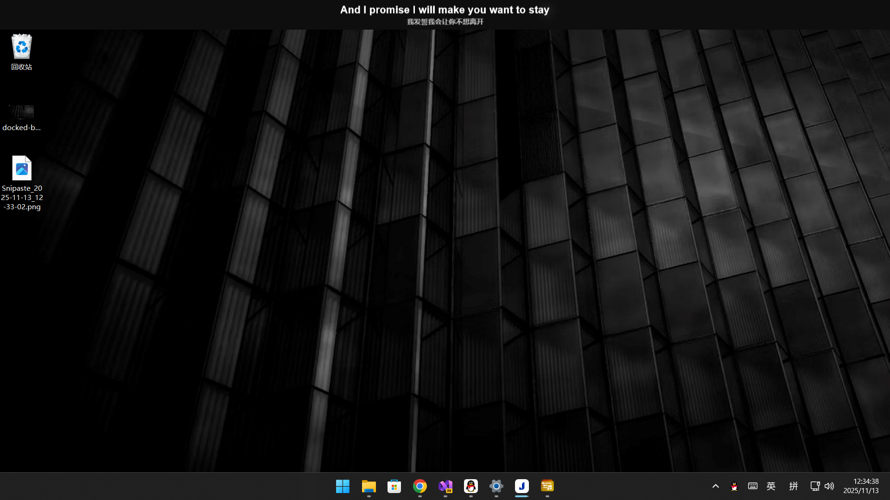
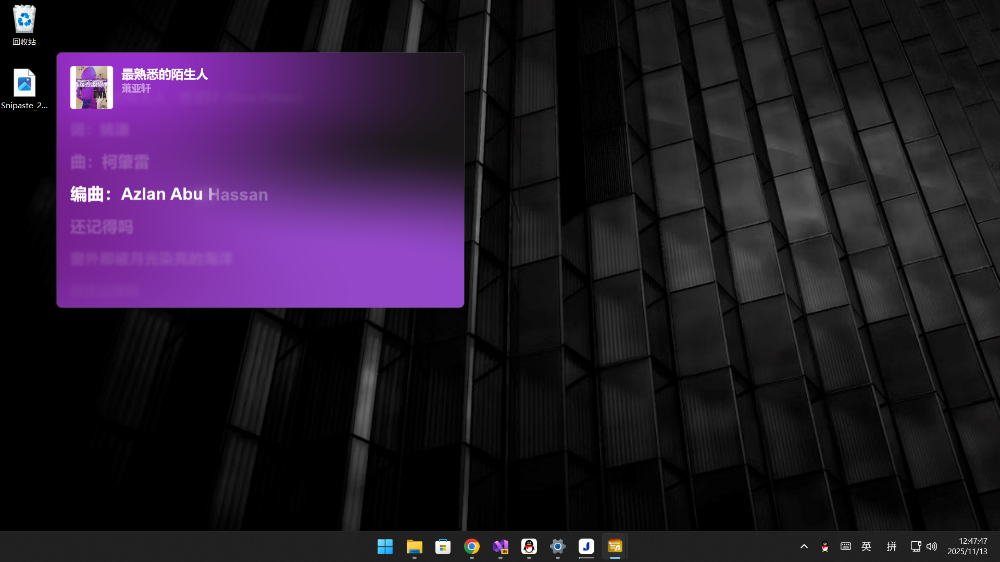
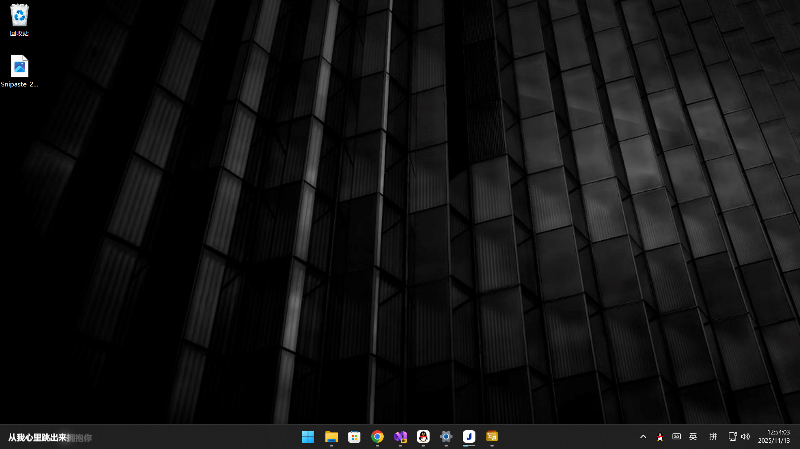

# Welcome to ShareHub | 欢迎来到 ShareHub

## Shared lyrics window status | 已分享的歌词窗口状态

Click on the links below to view and download the config files. | 点击以下链接查看和下载配置文件。

Each link is accompanied by a preview image of the lyrics window in that specific status. | 每个链接都附带该状态下歌词窗口的预览图像。

---

### [Desktop | 桌面](LyricsWindowStatus/desktop.json)

  

---

### [Docked (Bottom) | 停靠（底部）](LyricsWindowStatus/docked-bottom.json)

  

---

### [Docked (Top) | 停靠（顶部）](LyricsWindowStatus/docked-top.json)

  

---

### [Fullscreen (Horizontal) | 全屏（横屏）](LyricsWindowStatus/fs-horiz.json)

  

---

### [Fullscreen (Vertical) | 全屏（竖屏）](LyricsWindowStatus/fs-vert.json)

  

---

### [Standard (Horizontal) | 标准（横屏）](LyricsWindowStatus/std-horiz.json)

  

---

### [Standard (Vertical) | 标准（竖屏）](LyricsWindowStatus/std-vert.json)

  

---

### [Taskbar | 任务栏](LyricsWindowStatus/taskbar.json)

  

---
