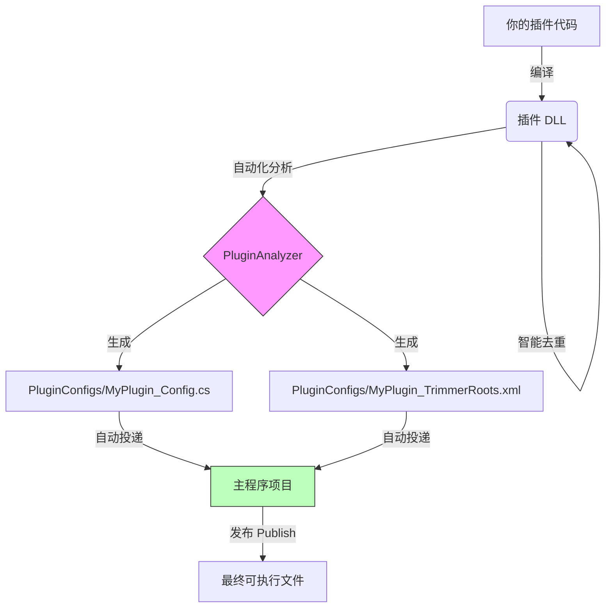

**中文** | [**English**](PLUGIN_DEV.md)

# BetterLyrics 插件开发指南 🧩

欢迎开发 BetterLyrics 插件！本文档将指导你如何创建一个标准插件，并利用我们的自动化构建工具链，完美解决 .NET 裁剪（Trimming）和依赖冲突问题。

## 🛠️ 核心机制简介

为了保证插件在主程序发布（Native AOT / Trimmed）后依然稳定运行，我们采用了一套自动化工作流：

1.  **智能去重**：编译时，脚本会自动检测主程序已有的 DLL（如 `Newtonsoft.Json`、`BetterLyrics.Core`），并从插件输出目录中剔除，防止版本冲突。
2.  **自动分析**：编译后，`PluginAnalyzer` 工具会扫描你的插件，分析缺失的 System 库依赖。
3.  **自动注册**：工具会在主程序的 `PluginConfigs` 目录生成配置，利用 `[ModuleInitializer]` 实现插件自动挂载，无需手动写注册代码。

---

## 🚀 快速开始

### 1. 创建项目

创建一个 **类库 (Class Library)** 项目。

* **框架**：`.NET 10`。
* **平台**：`net10.0-windows10.0.19041.0`。

### 2. 配置 `.csproj` (关键步骤)

请将你的 `.csproj` 文件内容替换为以下标准模板。这段配置包含了自动化构建的所有黑科技。

> ⚠️ **注意**：请根据实际文件结构，修改 `<HostProjectDir>` 和 `<AnalyzerPath>` 的路径。

```xml
<Project Sdk="Microsoft.NET.Sdk">

	<PropertyGroup>
		<TargetFramework>net10.0-windows10.0.26100.0</TargetFramework>
		<ImplicitUsings>enable</ImplicitUsings>
		<Nullable>enable</Nullable>
		<SupportedOSPlatformVersion>10.0.19041.0</SupportedOSPlatformVersion>
		<RuntimeIdentifiers>win-x86;win-x64;win-arm64</RuntimeIdentifiers>
		<EnableDynamicLoading>true</EnableDynamicLoading>
	</PropertyGroup>

	<ItemGroup>
		<ProjectReference Include="..\BetterLyrics.Core\BetterLyrics.Core.csproj">
			<Private>false</Private>
			<ExcludeAssets>runtime</ExcludeAssets>
		</ProjectReference>
	</ItemGroup>

	<Target Name="AutoExcludeSharedAssemblies" AfterTargets="ResolveAssemblyReferences">
		<PropertyGroup>
			<HostOutputDir>
				..\BetterLyrics.WinUI3\BetterLyrics.WinUI3\bin\x64\$(Configuration)\$(TargetFramework)\</HostOutputDir>
		</PropertyGroup>

		<Message Text="[Debug] Searching for Host Assemblies in: $(HostOutputDir)" Importance="High" />

		<ItemGroup>
			<FilesToCopy Include="@(ReferenceCopyLocalPaths)" />
			<SharedFiles Include="@(FilesToCopy)"
				Condition="Exists('$(HostOutputDir)%(Filename)%(Extension)')" />
			<ReferenceCopyLocalPaths Remove="@(SharedFiles)" />
		</ItemGroup>

		<Message
			Text="[Smart Trim] Excluded shared assemblies:%0a@(SharedFiles->'    -> %(Filename)%(Extension)', '%0a')"
			Importance="High" Condition="'@(SharedFiles)' != ''" />
	</Target>

	<Target Name="RunPluginAnalyzer" AfterTargets="Build">
		<PropertyGroup>
			<AnalyzerPath>..\PluginAnalyzer\bin\Debug\net10.0\PluginAnalyzer.exe</AnalyzerPath>
			<ScanDir>$(TargetDir)</ScanDir>
			<Ns>BetterLyrics.WinUI3</Ns>
			<Prefix>$(ProjectName)</Prefix>

			<OutputDir>..\BetterLyrics.WinUI3\BetterLyrics.WinUI3\PluginConfigs\</OutputDir>
		</PropertyGroup>

		<Message Text="[Analyzer] Delivering configs to Main App..." Importance="High" />
		<Exec
			Command="&quot;$(AnalyzerPath)&quot; &quot;$(ScanDir)\&quot; &quot;$(Ns)&quot; &quot;$(Prefix)&quot; &quot;$(OutputDir)\&quot;" />
	</Target>

</Project>
```

---

## 💻 开发流程

### 1. 引用依赖
你可以像平常一样引用 NuGet 包或第三方 DLL。
* **如果是公共库**（如 `Newtonsoft.Json`）：无需做任何事，脚本会自动检测主程序里有没有。如果有，编译时自动剔除，运行时直接使用主程序加载的版本。
* **如果是私有库**（如 `MeCab`）：脚本检测到主程序没有，会将其保留在你的插件目录里。

### 2. 实现接口
在代码中实现 `BetterLyrics.Core` 提供的接口（例如 `ILyricsSearchPlugin`）。

```csharp
using BetterLyrics.Core;

namespace BetterLyrics.Plugins.MyPlugin;

public class MyLyricsSearchPlugin : ILyricsSearchPlugin
{
    public string Id => "your_name.plugin_name";

    public string Name => "Plugin display name";
    
    public string Description => "Plugin description.";
    
    public string Author => "Your name";

    public void Initialize()
    {
        // Do something if necessary ...
        // string? pluginPath = Path.GetDirectoryName(Assembly.GetExecutingAssembly().Location);
    }
    
    public async Task<LyricsSearchResult> GetLyricsAsync(string title, string artist, string album, double duration)
    {
        // Your code here
        return new LyricsSearchResult(...);
    }
}
```

### 3. 编译构建
点击 Visual Studio 的 **生成 (Build)**。

观察 **输出 (Output)** 窗口，你会看到自动化工具在工作：
1.  `[Smart Trim]`：告诉你哪些库被剔除了（例如 `BetterLyrics.Core.dll`）。
2.  `[Analyzer]`：告诉你防裁剪配置文件 (`*_TrimmerRoots.xml`) 已经生成，并成功投递到了主程序的 `PluginConfigs` 文件夹。

---

## 🔍 原理详解 (Advanced)

### 为什么我看不到生成的配置文件？
生成的配置文件不会在你的插件项目里，而是直接生成到了 **主程序** 的 `PluginConfigs` 文件夹下。

### 生成了什么？
1.  **`MyPlugin_TrimmerRoots.xml`**：
    告诉主程序的裁剪器（Trimmer），保留所有你的插件需要用到、但主程序看起来没用到的 System 库。它还包含了一条指令，强制保留生成的 Config 类。
2.  **`MyPlugin_TrimmingConfig.cs`**：
    包含一个带有 `[ModuleInitializer]` 特性的类。这个类会在主程序启动时 **自动运行**，确保相关的反射元数据被加载，防止运行时崩溃。

### 依赖关系图


---

## ⚠️ 注意事项

1.  **编译顺序**：
    请务必确保 **主程序 (Host) 至少被编译过一次**（Debug 或 Release 对应模式）。插件的去重脚本依赖于读取主程序的输出目录来进行比对。如果主程序 bin 目录是空的，插件可能会错误地打包所有依赖。
    
2.  **配置一致性**：
    如果你在 `Release` 模式下编译插件，确保主程序也是 `Release` 模式。脚本会自动根据 `$(Configuration)` 寻找对应的主程序输出路径。

3.  **私有依赖处理**：
    如果你引用了一个主程序也有、但你需要**不同版本**的库（这种情况极少见且不推荐），你需要修改 `.csproj` 脚本，移除自动剔除逻辑。

---

## 🙋‍♂️ 常见问题

**Q: 编译时报错 "命令 ... 已退出，代码为 9009" 或 "不是内部或外部命令"？**

A: 这说明构建脚本找不到 `PluginAnalyzer.exe`。请检查 `.csproj` 文件里的 `<AnalyzerPath>` 路径配置是否正确。

**Q: 运行时报错 "FileNotFoundException: BetterLyrics.Core"?**

A: 这是正常的。插件目录下不应该有 `BetterLyrics.Core.dll`（因为它由主程序提供）。请通过主程序加载插件进行测试，而不是直接运行插件 DLL。

**Q: 发布后插件崩溃，提示 System 库找不到？**

A: 请检查主程序的 `PluginConfigs` 目录下是否成功生成了对应的 `*_TrimmerRoots.xml` 文件。如果没有，请尝试重新生成插件项目。
