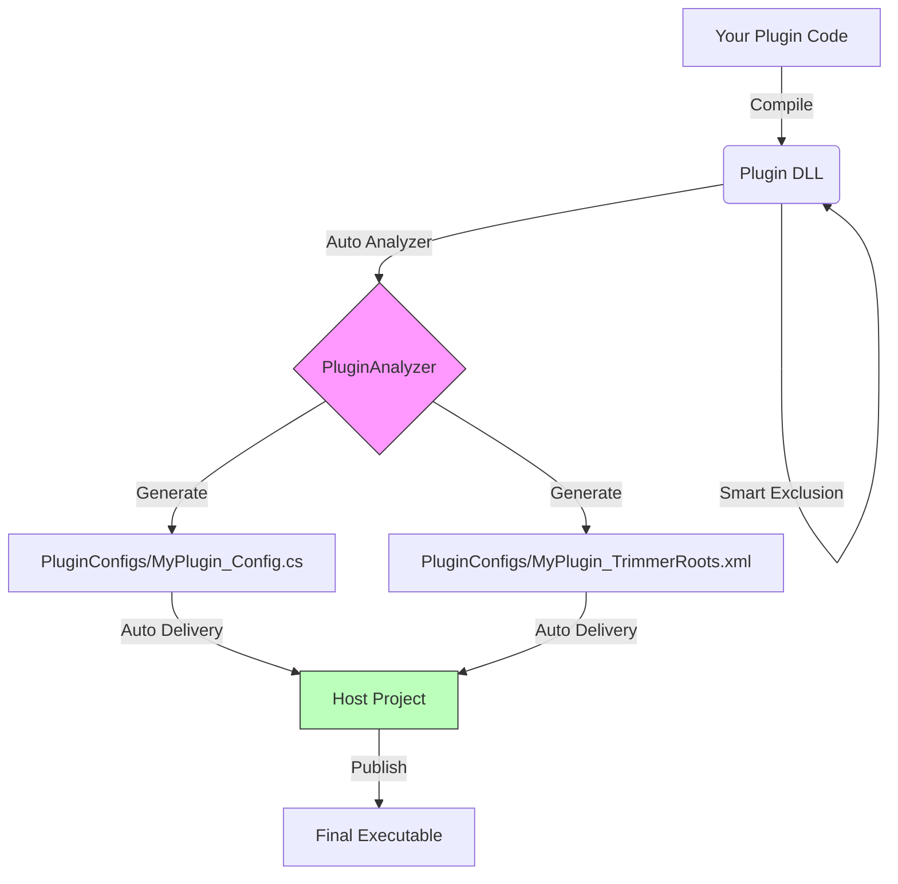

# BetterLyrics Plugin Development Guide 🧩

Welcome to BetterLyrics plugin development! This document guides you through creating a standard plugin and using our automated build toolchain to perfectly resolve .NET Trimming and dependency conflict issues.

## 🛠️ Core Mechanics

To ensure plugins run stably after the main application is published (Native AOT / Trimmed), we use an automated workflow:

1.  **Smart Exclusion**: During compilation, a script automatically detects DLLs already present in the host application (e.g., `Newtonsoft.Json`, `BetterLyrics.Core`) and removes them from the plugin output directory to prevent version conflicts.
2.  **Auto Analysis**: After compilation, the `PluginAnalyzer` tool scans your plugin to analyze missing System library dependencies.
3.  **Auto Registration**: The tool generates configurations in the host's `PluginConfigs` directory and uses `[ModuleInitializer]` to achieve automatic plugin mounting, eliminating the need for manual registration code.

---

## 🚀 Quick Start

### 1. Create Project

Create a **Class Library** project.

* **Framework**: `.NET 10`.
* **Platform**: `net10.0-windows10.0.19041.0`.

### 2. Configure `.csproj` (Key Step)

Please replace the content of your `.csproj` file with the standard template below. This configuration contains all the "magic" for the automated build process.

> ⚠️ **Note**: Please modify the paths for `<HostProjectDir>` and `<AnalyzerPath>` according to your actual file structure.

```xml
<Project Sdk="Microsoft.NET.Sdk">

    <PropertyGroup>
        <TargetFramework>net10.0-windows10.0.26100.0</TargetFramework>
        <ImplicitUsings>enable</ImplicitUsings>
        <Nullable>enable</Nullable>
        <SupportedOSPlatformVersion>10.0.19041.0</SupportedOSPlatformVersion>
        <RuntimeIdentifiers>win-x86;win-x64;win-arm64</RuntimeIdentifiers>
        <EnableDynamicLoading>true</EnableDynamicLoading>
    </PropertyGroup>

    <ItemGroup>
        <ProjectReference Include="..\BetterLyrics.Core\BetterLyrics.Core.csproj">
            <Private>false</Private>
            <ExcludeAssets>runtime</ExcludeAssets>
        </ProjectReference>
    </ItemGroup>

    <Target Name="AutoExcludeSharedAssemblies" AfterTargets="ResolveAssemblyReferences">
        <PropertyGroup>
            <HostOutputDir>..\BetterLyrics.WinUI3\BetterLyrics.WinUI3\bin\x64\$(Configuration)\$(TargetFramework)\</HostOutputDir>
        </PropertyGroup>

        <Message Text="[Debug] Searching for Host Assemblies in: $(HostOutputDir)" Importance="High" />

        <ItemGroup>
            <FilesToCopy Include="@(ReferenceCopyLocalPaths)" />
            <SharedFiles Include="@(FilesToCopy)" Condition="Exists('$(HostOutputDir)%(Filename)%(Extension)')" />
            <ReferenceCopyLocalPaths Remove="@(SharedFiles)" />
        </ItemGroup>

        <Message Text="[Smart Trim] Excluded shared assemblies:%0a@(SharedFiles->'    -> %(Filename)%(Extension)', '%0a')" Importance="High" Condition="'@(SharedFiles)' != ''" />
    </Target>

    <Target Name="RunPluginAnalyzer" AfterTargets="Build">
        <PropertyGroup>
            <AnalyzerPath>..\PluginAnalyzer\bin\Debug\net10.0\PluginAnalyzer.exe</AnalyzerPath>
            <ScanDir>$(TargetDir)</ScanDir>
            <Ns>BetterLyrics.WinUI3</Ns>
            <Prefix>$(ProjectName)</Prefix>

            <OutputDir>..\BetterLyrics.WinUI3\BetterLyrics.WinUI3\PluginConfigs\</OutputDir>
        </PropertyGroup>

        <Message Text="[Analyzer] Delivering configs to Main App..." Importance="High" />
        <Exec Command="&quot;$(AnalyzerPath)&quot; &quot;$(ScanDir)\&quot; &quot;$(Ns)&quot; &quot;$(Prefix)&quot; &quot;$(OutputDir)\&quot;" />
    </Target>

</Project>
```

---

## 💻 Development Workflow

### 1. Referencing Dependencies

You can reference NuGet packages or third-party DLLs as usual.

* **Shared Libraries** (e.g., `Newtonsoft.Json`): Do nothing. The script automatically detects if the host has it. If so, it's excluded during the plugin build, and the host's version is used at runtime.
* **Private Libraries** (e.g., `MeCab`): If the script detects the host doesn't have it, it will be preserved in your plugin directory.

### 2. Implementing Interfaces

Implement the interfaces provided by `BetterLyrics.Core` (e.g., `ILyricsSearchPlugin`) in your code.

```csharp
using BetterLyrics.Core;

namespace BetterLyrics.Plugins.MyPlugin;

public class MyLyricsSearchPlugin : ILyricsSearchPlugin
{
    public string Id => "your_name.plugin_name";

    public string Name => "Plugin display name";
    
    public string Description => "Plugin description.";
    
    public string Author => "Your name";

    public void Initialize()
    {
        // Do something if necessary ...
        // string? pluginPath = Path.GetDirectoryName(Assembly.GetExecutingAssembly().Location);
    }
    
    public async Task<LyricsSearchResult> GetLyricsAsync(string title, string artist, string album, double duration)
    {
        // Your code here
        return new LyricsSearchResult(...);
    }
}
```

### 3. Build & Compile

Click **Build** in Visual Studio.

Observe the **Output** window; you will see the automation tools at work:

1.  `[Smart Trim]`: Tells you which libraries were excluded (e.g., `BetterLyrics.Core.dll`).
2.  `[Analyzer]`: Tells you that the anti-trimming configuration (`*_TrimmerRoots.xml`) has been generated and successfully delivered to the host's `PluginConfigs` folder.

---

## 🔍 Deep Dive (Advanced)

### Why can't I see the generated config files?

The generated configuration files are not located in your plugin project; they are generated directly into the **Host Application's** `PluginConfigs` folder.

### What was generated?

1.  **`MyPlugin_TrimmerRoots.xml`**:
    Tells the host's Trimmer to preserve all System libraries required by your plugin that the host might otherwise discard. It also includes an instruction to force-preserve the generated Config class.
2.  **`MyPlugin_TrimmingConfig.cs`**:
    Contains a class with the `[ModuleInitializer]` attribute. This class runs **automatically** when the host starts, ensuring relevant reflection metadata is loaded to prevent runtime crashes.

### Dependency Graph



---

## ⚠️ Precautions

1.  **Build Order**:
    Please ensure the **Host Application is compiled at least once** (in the corresponding Debug or Release mode). The plugin's exclusion script relies on reading the host's output directory for comparison. If the host's bin directory is empty, the plugin might incorrectly bundle all dependencies.

2.  **Configuration Consistency**:
    If you compile the plugin in `Release` mode, ensure the host is also in `Release` mode. The script automatically looks for the corresponding host output path based on `$(Configuration)`.

3.  **Private Dependency Handling**:
    If you reference a library that the host also has, but you require a **different version** (this is rare and not recommended), you will need to modify the `.csproj` script to remove the automatic exclusion logic.

---

## 🙋‍♂️ FAQ

**Q: Build error "Command ... exited with code 9009" or "is not recognized as an internal or external command"?**

A: This means the build script cannot find `PluginAnalyzer.exe`. Please check if the `<AnalyzerPath>` configuration in your `.csproj` file is correct.

**Q: Runtime error "FileNotFoundException: BetterLyrics.Core"?**

A: This is normal. `BetterLyrics.Core.dll` should not exist in the plugin directory (as it is provided by the host). Please test by loading the plugin via the host application, rather than running the plugin DLL directly.

**Q: Plugin crashes after Publish, stating a System library is missing?**

A: Please check if the corresponding `*_TrimmerRoots.xml` file was successfully generated in the host's `PluginConfigs` directory. If not, try rebuilding the plugin project.
