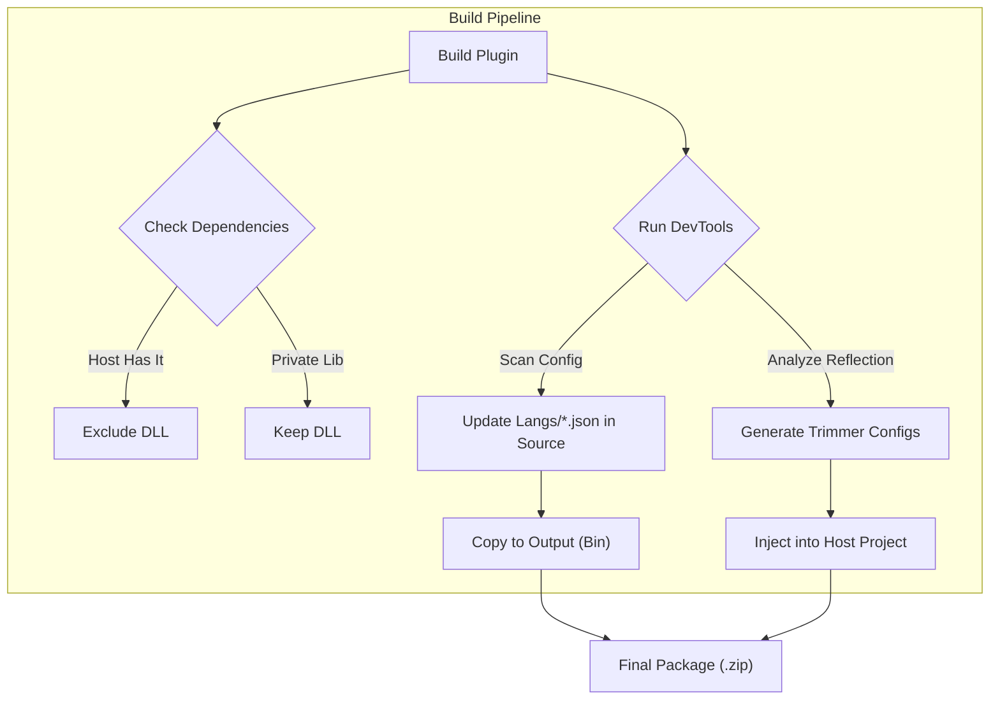

# 🧩 BetterLyrics Plugin Development Guide

> ⚠️ **PREVIEW / UNRELEASED**
>
> This documentation is currently a **Preview** for an unreleased version of BetterLyrics.
> The APIs, build tools, and workflows described here are **unstable** and subject to breaking changes without notice.
> Please use with caution and expect frequent updates.

Welcome to the ecosystem! This guide will help you create high-performance plugins for BetterLyrics.

Our build chain is highly automated. We use a **"Code-First"** approach where your code is the source of truth, and our tools handle the tedious parts: avoiding dependency conflicts (DLL Hell), resolving Native AOT trimming issues, and generating multi-language resources.

---

## 🛠️ The "Magic" Behind the Build

To ensure your plugin is stable, performant, and compatible with the Native AOT host, we use a custom MSBuild pipeline:

1.  **🚫 Smart Exclusion**: The build script detects if the Host App already has a library you are using (e.g., `Newtonsoft.Json`). If found, it removes it from your output to prevent version conflicts.
2.  **🌍 Source-First Localization**: The `DevTools` scan your `Config` class and automatically generate/update JSON language files in your source directory.
3.  **🛡️ Anti-Trim Injection**: The tools analyze your reflection usage and inject `TrimmerRoots.xml` and `ModuleInitializer` code directly into the Host App, ensuring your plugin survives the AOT linking process.



---

## 🚀 Quick Start

### 1. Prerequisites
* **IDE**: Visual Studio 2026 (latest).
* **SDK**: .NET 10 SDK (Ensure you have the preview/release version installed).
* **Host Source**: You need the `BetterLyrics` solution locally to reference `Core` and `DevTools`.

### 2. Create Project
Create a new **Class Library** project.
* **Target Framework**: `.NET 10` (`net10.0-windows10.0.26100.0`).

### 3. Configure `.csproj` (The Key Step)
Replace your `.csproj` content with the template below. This template wires up the entire automated toolchain.

> **Note**: Adjust the `TargetFramework` and `HostOutputDir` paths if your environment differs.

```xml
<Project Sdk="Microsoft.NET.Sdk">

  <PropertyGroup>
    <TargetFramework>net10.0-windows10.0.26100.0</TargetFramework>
    <ImplicitUsings>enable</ImplicitUsings>
    <Nullable>enable</Nullable>
    <SupportedOSPlatformVersion>10.0.19041.0</SupportedOSPlatformVersion>
    <RuntimeIdentifiers>win-x86;win-x64;win-arm64</RuntimeIdentifiers>
    <EnableDynamicLoading>true</EnableDynamicLoading>
    
    <Version>1.0.0</Version>
    <Authors>YourName</Authors>
    <Company>$(Authors)</Company>
    <Copyright>Copyright © Year YourName</Copyright>
  </PropertyGroup>

  <ItemGroup>
    <ProjectReference Include="..\..\BetterLyrics.Core\BetterLyrics.Core.csproj">
      <Private>false</Private>
      <ExcludeAssets>runtime</ExcludeAssets>
    </ProjectReference>
  </ItemGroup>

  <Target Name="AutoExcludeSharedAssemblies" AfterTargets="ResolveAssemblyReferences">
    <PropertyGroup>
      <HostOutputDir>..\..\BetterLyrics.WinUI3\bin\x64\$(Configuration)\$(TargetFramework)\win-x64\</HostOutputDir>
    </PropertyGroup>

    <Message Text="[Smart Trim] Checking Host Assemblies in: $(HostOutputDir)" Importance="High" />

    <ItemGroup>
      <FilesToCopy Include="@(ReferenceCopyLocalPaths)" />
      <SharedFiles Include="@(FilesToCopy)" Condition="Exists('$(HostOutputDir)%(Filename)%(Extension)')" />
      <ReferenceCopyLocalPaths Remove="@(SharedFiles)" />
    </ItemGroup>

    <Message Text="[Smart Trim] Excluded shared libs:%0a@(SharedFiles->'    -> %(Filename)%(Extension)', '%0a')" Importance="High" Condition="'@(SharedFiles)' != ''" />
  </Target>

  <Target Name="RunDevTools" AfterTargets="PostBuildEvent">
    <PropertyGroup>
      <AnalyzerPath>..\..\BetterLyrics.DevTools\bin\$(Configuration)\$(TargetFramework)\BetterLyrics.DevTools.exe</AnalyzerPath>
      <MainAppConfigDir>..\..\BetterLyrics.WinUI3\PluginConfigs\</MainAppConfigDir>
      
      <SourceLangDir>$(ProjectDir)Langs\</SourceLangDir>
      <OutputLangDir>$(TargetDir)Langs\</OutputLangDir>
    </PropertyGroup>

    <Message Text="[DevTools] Phase 1: Analyzing &amp; Generating Resources..." Importance="High" />

    <Exec Command="&quot;$(AnalyzerPath)&quot; &quot;$(TargetPath)&quot; All &quot;$(ProjectDir)\&quot;" />

    <Message Text="[DevTools] Phase 2: Syncing Resources to Output..." Importance="High" />

    <ItemGroup>
      <FreshLangFiles Include="$(SourceLangDir)*.json" />
    </ItemGroup>
    <Copy SourceFiles="@(FreshLangFiles)" DestinationFolder="$(OutputLangDir)" />

    <Copy SourceFiles="$(TargetDir)$(ProjectName)_TrimmingConfig.cs" DestinationFolder="$(MainAppConfigDir)" SkipUnchangedFiles="true" />
    <Copy SourceFiles="$(TargetDir)$(ProjectName)_TrimmerRoots.xml" DestinationFolder="$(MainAppConfigDir)" SkipUnchangedFiles="true" />
  </Target>
  
  <Target Name="PackagePluginToZip" AfterTargets="Build">
    <PropertyGroup>
      <PackageOutputDir>$(ProjectDir)..\_Dist\$(Configuration)\</PackageOutputDir>
      <ZipFileName>$(AssemblyName).v$(Version).zip</ZipFileName>
      <FinalZipPath>$(PackageOutputDir)$(ZipFileName)</FinalZipPath>
    </PropertyGroup>

    <ZipDirectory SourceDirectory="$(OutputPath)" DestinationFile="$(FinalZipPath)" Overwrite="true" />
    <Message Text="[Packager] Plugin ready: $(FinalZipPath)" Importance="High" />
  </Target>

</Project>
```

---

## 💻 Coding Workflow

### 1. The Plugin Class (`Plugin.cs`)
Implement your logic here. Use `Context.PluginDirectory` if you need to access local files.

```csharp
using BetterLyrics.Core.Abstractions;
using BetterLyrics.Core.Helpers;
using BetterLyrics.Core.Interfaces.Features;
using BetterLyrics.Core.Interfaces.Services;
using BetterLyrics.Core.Models.SettingsSchema;

namespace BetterLyrics.Plugins.MyFeature
{
    // TConfig links your configuration class
    public class Plugin : PluginBase<Config>, ILyricsTransliterator
    {
        public override string Name => "My Cool Plugin";
        public override string Description => "Does amazing things with lyrics.";

        protected override async Task OnInitializeAsync()
        {
            // Initialization logic (runs once on load)
            await Task.CompletedTask;
        }

        public Task<string?> GetTransliterationAsync(string text, string targetLangCode)
        {
            // Implementation...
            return Task.FromResult(text.ToUpper());
        }

        public override IEnumerable<SettingDef> GetSettings()
        {
            // ...
            yield return SettingBuilder.Text(() => Config.ApiKey, Context.Localizer);
        }
    }
}
```

### 2. Configuration & Localization (`Config.cs`)
This is the **Source of Truth**. Define properties here.

* **You write Code**: Add properties.
* **Tool writes JSON**: On build, `DevTools` creates/updates `Langs/*.json`.

```csharp
using System.ComponentModel.DataAnnotations;
using BetterLyrics.Core.Abstractions;

namespace BetterLyrics.Plugins.MyFeature
{
    public class Config : PluginConfigBase
    {
        public string ApiKey
        {
            get => Get("");
            set => Set(value);
        }

        public int MaxRetries
        {
            get => Get(3);
            set => Set(value);
        }
    }
}
```

### 3. Handling Translations (I18n)
After you build the project once:
1.  Look at your **Solution Explorer**. You will see a `Langs` folder appear.
2.  Open `Langs/*.json`. It will contain the keys generated from your Config code.
3.  **Updates**: If you add a new property to `Config.cs` later and rebuild, the tool will **automatically append** the new key to `zh-CN.json` marked with `[TODO]`, preserving your existing translations.

---

## 🔍 Troubleshooting & FAQ

### 🔴 Build Error: `Command ... BetterLyrics.DevTools.exe exited with code 9009`
**Reason**: The build script cannot find the `DevTools` executable.
**Fix**:
1.  Check the `<AnalyzerPath>` in your `.csproj`.
2.  Ensure you have built the `BetterLyrics.DevTools` project at least once.

### 🔴 Runtime Error: `FileNotFoundException: BetterLyrics.Core`
**Reason**: You tried to run the plugin DLL manually or the `Smart Exclusion` failed.
**Fix**:
1.  This is **expected**. The plugin *should not* contain `BetterLyrics.Core.dll` because the Host provides it.
2.  Test the plugin by loading it via the Host Application.

### 🔴 Runtime Error: `TypeLoadException: Could not load type 'PluginConfigBase'`
**Reason**: The Host Application is running an older version of `BetterLyrics.Core` than the one your plugin was compiled against.
**Fix**:
1.  **Rebuild the Host Application** (`BetterLyrics.WinUI3`) to ensure it has the latest Core.
2.  Ensure no rogue `BetterLyrics.Core.dll` copies exist in your `LocalState/plugins` folder.

### 🟡 Warning: `System library missing` after Publish
**Reason**: The Native AOT trimmer stripped away a system class you used via reflection.
**Fix**:
1.  Check the Host's `PluginConfigs` folder. Does `MyPlugin_TrimmerRoots.xml` exist?
2.  If yes, rebuild the Host. The config acts as a whitelist for the Trimmer.
