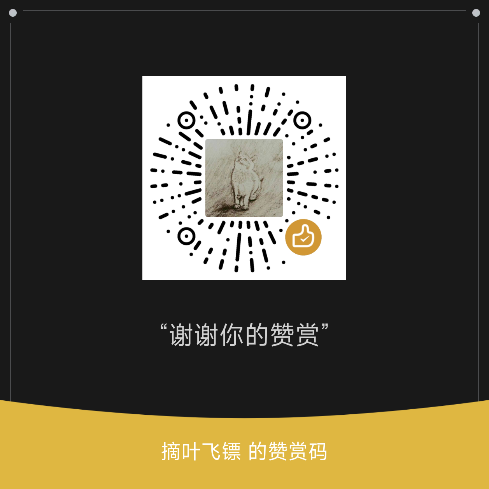

  
  <h1>BetterLyrics</h1>

  <h4>
    🤩 一款优雅且高度自定义的歌词可视化与全能音乐播放应用  
    基于 WinUI3 / Win2D 构建
  </h4>

  

    
    
    
    
    
  

   

  

 

## 🔥 精选推荐与社区

| HelloGitHub 推荐 | 少数派 SSPAI 推荐 | 🤖 AI 问答 |
| :---: | :---: | :---: |
|  | [**阅读评测文章**](https://sspai.com/post/101028) |    [![Zread](https://img.shields.io/badge/Ask_Zread-_.svg?style=flat&color=00b0aa&labelColor=000000&logo=data%3Aimage%2Fsvg%2Bxml%3Bbase64%2CPHN2ZyB3aWR0aD0iMTYiIGhlaWdodD0iMTYiIHZpZXdCb3g9IjAgMCAxNiAxNiIgZmlsbD0ibm9uZSIgeG1sbnM9Imh0dHA6Ly93d3cudzMub3JnLzIwMDAvc3ZnIj4KPHBhdGggZD0iTTQuOTYxNTYgMS42MDAxSDIuMjQxNTZDMS44ODgxIDEuNjAwMSAxLjYwMTU2IDEuODg2NjQgMS42MDE1NiAyLjI0MDFWNC45NjAxQzEuNjAxNTYgNS4zMTM1NiAxLjg4ODEgNS42MDAxIDIuMjQxNTYgNS42MDAxSDQuOTYxNTZDNS4zMTUwMiA1LjYwMDEgNS42MDE1NiA1LjMxMzU2IDUuNjAxNTYgNC45NjAxVjIuMjQwMUM1LjYwMTU2IDEuODg2NjQgNS4zMTUwMiAxLjYwMDEgNC45NjE1NiAxLjYwMDFaIiBmaWxsPSIjZmZmIi8%2BCjxwYXRoIGQ9Ik00Ljk2MTU2IDEwLjM5OTlIMi4yNDE1NkMxLjg4ODEgMTAuMzk5OSAxLjYwMTU2IDEwLjY4NjQgMS42MDE1NiAxMS4wMzk5VjEzLjc1OTlDMS42MDE1NiAxNC4xMTM0IDEuODg4MSAxNC4zOTk5IDIuMjQxNTYgMTQuMzk5OUg0Ljk2MTU2QzUuMzE1MDIgMTQuMzk5OSA1LjYwMTU2IDE0LjExMzQgNS42MDE1NiAxMy43NTk5VjExLjAzOTlDNS42MDE1NiAxMC42ODY0IDUuMzE1MDIgMTAuMzk5OSA0Ljk2MTU2IDEwLjM5OTlaIiBmaWxsPSIjZmZmIi8%2BCjxwYXRoIGQ9Ik0xMy43NTg0IDEuNjAwMUgxMS4wMzg0QzEwLjY4NSAxLjYwMDEgMTAuMzk4NCAxLjg4NjY0IDEwLjM5ODQgMi4yNDAxVjQuOTYwMUMxMC4zOTg0IDUuMzEzNTYgMTAuNjg1IDUuNjAwMSAxMS4wMzg0IDUuNjAwMUgxMy43NTk5QzE0LjExMTkgNS42MDAxIDE0LjM5ODQgNS4zMTM1NiAxNC4zOTg0IDQuOTYwMVYyLjI0MDFDMTQuMzk4NCAxLjg4NjY0IDE0LjExMTkgMS42MDAxIDEzLjc1ODQgMS42MDAxWiIgZmlsbD0iI2ZmZiIvPgo8cGF0aCBkPSJNNCAxMkwxMiA0TDQgMTJaIiBmaWxsPSIjZmZmIi8%2BCjxwYXRoIGQ9Ik00IDEyTDEyIDQiIHN0cm9rZT0iI2ZmZiIgc3Ryb2tlLXdpZHRoPSIxLjUiIHN0cm9rZS1saW5lY2FwPSJyb3VuZCIvPgo8L3N2Zz4K&logoColor=ffffff)](https://zread.ai/jayfunc/BetterLyrics) |

**交流群：** [QQ 群（1054700388）](https://qun.qq.com/universal-share/share?ac=1&authKey=4Q%2BYTq3wZldYpF5SbS5c19ECFsiYoLZFAIcBNNzYpBUtiEjaZ8sZ%2F%2BnFN0qw3lad&busi_data=eyJncm91cENvZGUiOiIxMDU0NzAwMzg4IiwidG9rZW4iOiJiVnhqemVYN0N5QVc3b1ZkR24wWmZOTUtvUkJoWm1JRWlaWW5iZnlBcXJtZUtGc2FFTHNlUlFZMi9iRm03cWF5IiwidWluIjoiMTM5NTczOTY2MCJ9&data=39UmAihyH_o6CZaOs7nk2mO_lz2ruODoDou6pxxh7utcxP4WF5sbDBDOPvZ_Wqfzeey4441anegsLYQJxkrBAA&svctype=4&tempid=h5_group_info) | [QQ 频道（BetterLyrics4U）](https://pd.qq.com/s/1u1ntkyzr?b=9) | [Discord](https://discord.gg/5yAQPnyCKv) | [Telegram](https://t.me/+svhSLZ7awPsxNGY1)

## 🧪 下载与安装

| Microsoft Store (推荐) | 手动安装 |
| :---: | :---: |
|  无限期免费试用（功能与付费版一致） | [**📦 最新版本 (.zip)**](https://github.com/jayfunc/BetterLyrics/releases/latest) [查看安装指南](https://www.cnblogs.com/jayfunc/p/19212078) |

[📖 用户指南](USER_GUIDE.CN.md) | [🔒 隐私政策](PRIVACY_POLICY.CN.md) | [⚖️ 服务条款](TERMS_OF_SERVICE.CN.md)

## 🌟 核心功能

- 🎨 **绝美视觉与 UI**
  - **优雅设计：** 基于 WinUI3 & Win2D 的流畅、高度个性化风格。
  - **沉浸特效：** 支持流体背景、3D/扇形歌词、雪花粒子等多种效果。
  - **深度定制：** 按需配置动画、字体和行为逻辑，打造你的专属播放器。

- 🎧 **多功能播放与连接**
  - **内置播放器：** 支持播放 **本地硬盘** 文件或通过 **网络协议** (SMB, WebDAV) 流式播放。
  - **外部集成：** 可视化来自 Spotify, Apple Music, 网易云音乐及 [其他多种播放器](https://github.com/jayfunc/BetterLyrics/wiki/使用指南#已知支持的音乐播放器配置指南) 的音乐。

- 🌐 **强大的歌词系统**
  - **离线翻译：** 注重隐私的本地机器翻译（支持 30+ 种语言）。
  - **全面源支持：** 支持 .lrc (标准/增强), .eslrc, .ttml, 内嵌标签，以及在线源（QQ 音乐, 网易云, LRCLIB）。
  - **Apple Music：** 支持歌词获取（需配置 Token）。

- 🪟 **全场景显示模式**
  - **标准模式：** 全屏沉浸式体验。
  - **停靠模式：** 贴附于屏幕边缘的精致侧边栏。
  - **桌面悬浮：** 悬浮于所有应用之上的歌词挂件。

- 🧠 **智能行为**
  - 音乐暂停时自动隐藏。

## 🖼️ 软件截图

| 标准视图 | 侧边栏模式 |
| :---: | :---: |
|  |  |

| 歌词视觉特效 | 多模式共存 |
| :---: | :---: |
|  |  |

| 全屏模式 | 全屏模式 |
| :---: | :---: |
|  |  |

| 音乐库 | 播放统计 |
| :---: | :---: |
|  |  |

## 📹 演示视频

> 观看我们在 Bilibili 发布的演示视频（上传于 2025 年 10 月 21 日）：[点击观看](https://www.bilibili.com/video/BV1QRstz1EGt/)。

## ✍️ 贡献与构建

**协助翻译：** 找不到你的语言？[点此开始翻译](https://github.com/jayfunc/BetterLyrics?tab=contributing-ov-file)。

**开发插件：** 想要扩展功能？[🧩 阅读插件开发指南](PLUGIN_DEV.CN.md)。

**从源码构建：**
> 构建前，请确保已替换 `Constants` 文件夹下的 `DiscordTemplate.cs` 和 `LastFM.cs`。

## 🤑 赞助与捐赠

如果你喜欢 BetterLyrics，请考虑支持它。你的支持有助于项目持续发展！

| 网页平台 | 支付宝 (扫码) | 微信 (扫码) |
| :---: | :---: | :---: |
| [PayPal](https://paypal.me/zhefangpay)  [Buy Me a Coffee](https://buymeacoffee.com/founchoo)  [爱发电 (Afdian)](https://afdian.com/a/jayfunc) |  |  |

**[查看完整赞助者名单 (Hall of Fame)](SPONSORS.md)**

## ⭐ Star 历史趋势

  

## 📄 许可与致谢

本项目采用 **GNU General Public License v3.0** 许可证。
